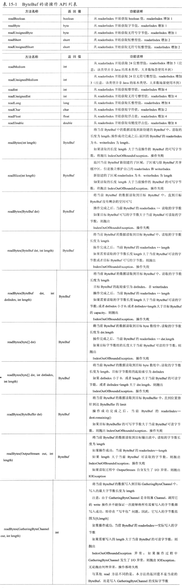

### ByteBuf的功能介绍

1. 顺序读操作(read)
> ByteBuf的read操作蕾西与ByteBuffer的get操作,主要API如下:
> 

从内存分配的角度看,ByteBuf可以分为两类

* 堆内存(HeapByteBuf)字节缓冲区:特点是内存的分配和回收速度快,可以被JVM自动回收;缺点是如果进行Socket的I/O读写,需要额外做一次内存复制,将堆内存对应的缓冲区复制到内核Channel中,性能会有一定程度的下降
* 直接内存(DirectByteBuf)字节缓冲区:非堆内存,它在堆外进行内存分配,相对于堆内存,它的分配和回收速度会慢一些,但是将它写入或者从Socket Channel中读取时,由于少了一次内存复制,速度比堆内存快

经验表明,ByteBuf的最佳实践是在I/O通信线程的读写缓冲区使用DirectByteBuf,后端业务消息的编解码模块使用HeapByteBuf,这样组合可以达到性能最优

从内存回收角度看,ByteBuf也分为两类

基于对象池的ByteBuf和普通ByteBuf. 两者的主要区别就是基于对象池的ByteBuf可以重用ByteBuf对象,它自己维护了一个内存池,可以循环利用创建的ByteBuf,提升内存的使用效率,降低由于高负载导致的频繁GC. 测试表明使用内存池后的Netty在高负载,大并发的冲击下内存和GC更加平稳

### AbstractByteBuf源码分析

1. 主要成员变量: leakDetector 用于检测对象是否泄露
2. 读操作簇
3. 写操作簇
4. 操作索引
5. 重用缓冲区

缓存扩张采用倍增或步进算法的原因:

如果以minNewCapacity作为目标容量,则本次扩张后的可写字节数刚好够本次写入使用. 写入完成后它的可写字节数会变为0, 下次做写入操作时,需要再次动态扩张. 这样会形成第一次动态扩张后, 每次写入操作都会进行动态扩张,由于动态扩张需要进行内存复制,频繁的内存复制会导致性能下降

337