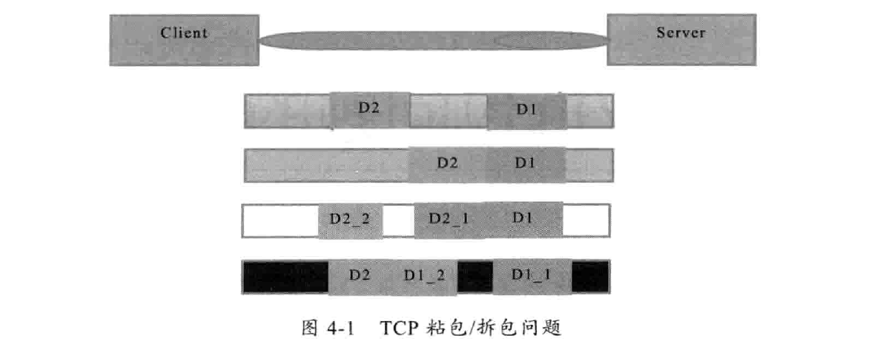
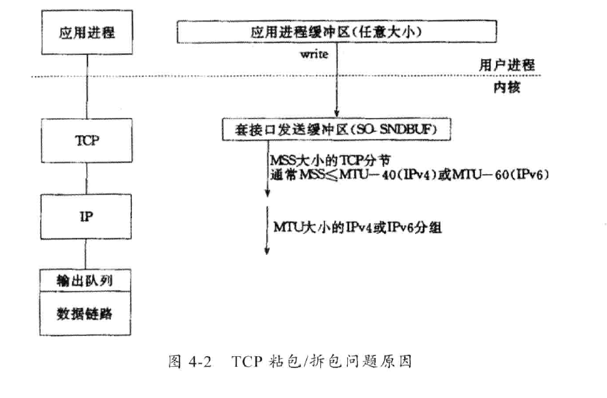

# TCP粘包/拆包的解决之道

### TCP 粘包/拆包问题说明

假设客户端分别发送了两个数据包D1和D2给服务端,由于服务端一次读取到的字节数是不确定的,故可能存在4中情况

* 服务端分两次读取到了两个独立的数据包,分别是D1和D2,没有粘包和拆包
* 服务端一次接收到了两个数据包,D1和D2粘合在了一起,被称为TCP粘包
* 服务端分两次读取到了两个数据包,第一次读取到了完整的D1包和D2包的部分内容,第二次读取到了D2包的剩余内容,被称为TCP拆包
* 服务端分两次去读到了两个数据包,第一次读取到了D1包的部分内容D1_1,第二次读取到了D1包的剩余内容和D2包的整包

如果此时服务端TCP接收滑窗非常小,而数据包D1和D2比较大,能有可能会发生第五种可能,即服务端分多次才能将D1和D2包接收完全,期间发生多次拆包

### TCP粘包/拆包发生的原因

* 应用程序write写入的字节大小大于套接口发送缓冲区大小
* 进行MSS大小的TCP分段
* 以太网帧的payload大于MTU进行IP分片

### 粘包问题的解决策略

由于底层的TCP无法理解上层的业务数据,所以再底层是无法保证数据包不被拆分和重组的,这个问题只能通过上层的应用协议栈设计来解决

* 消息定长,如每个保温的大小为固定长度200字节,如果不够,空位补空格
* 在包尾增加回车换行符分割,例如FTP协议
* 将消息分为消息头和消息体,消息头中包含表示消息总长度(或消息体长度)的字段,通常设计思路为消息头的第一个字段使用int32来表示消息的总长度
* 更复杂的应用层协议

