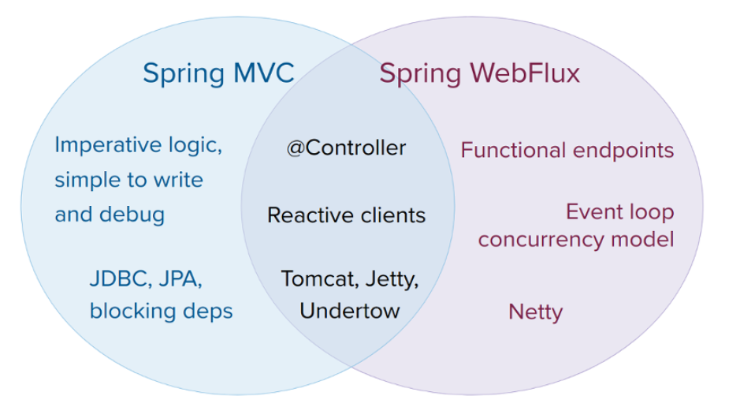

[TOC]

# Spring WebFlux

## Overview

Why was Spring WebFlux created?


Part of the answer is the need for a non-blocking web stack to handle concurrency with a small number of thread and scale with fewer hardware resources.

This was the motivation for a new common API to serve as  a foundation across any non-blocking runtime. That is important because of servers(such as Netty) that are well-established in the async, non-blocking space.

The other part of the answer is functional programming. Much as the addition of annotations in java 5 created opportunities, the addition of lambda expressions in java 8 created opportunities for functional APIs in Java. This is a boon for non-blocking applications and continuation-style APIs that allow declarative composition of asynchronous logic.

### Define “Reactive”

The term, “reactive”, refers to programming models that are built around reaction to change - network components reacting to I/O events, UI controllers reacting to mouse events, and others. In that sense, non-blocking is reactive, because, instead of being blocked, we are now in the mode of reacting to notifications as operations complete or data becomes available.

There is also another important mechanism that we on the Spring team associate with “reactive” and that is non-blocking back pressure.

The main purpose of Reactive Streams is to let the subscriber to control how quickly or how slowly the publisher produces data.

Common question: what if a publisher cannot slow down?

The purpose of Reactive Streams is only to establish the mechanism and a boundary. If a publisher cannot slow down, it has to decide whether to buffer, drop, or fail.

### Reactive API

Reactor is the reactive library of choice for Spring WebFlux. It provides the `Mono`and `Flux`API types to wok on data sequences of 0..1(`Mono`)and0..N(`Flux`)through a rich set of operators aligned with the ReactiveX vocabulary of operators. 

### Programming Models

The spring-web module contains the reactive foundation that underlies Spring WebFlux, including HTTP abstractions, Reactive Streams adapters for supported servers, codecs, and a core WebHandler API comparable to the Servlet API but with non-blocking contracts.

* Annotated Controllers
* Functional Endpoints

### Applicability



* If you have a Spring MVC application that works fine, there is no need to change. Imperative programming is the easiest way to write, understand, and debug code. You have maximum choice of libraries, since, historically, most are blocking
* If you are already shopping for a non-blocking web stack, Spring WebFlux offers the same execution model benefits as others in the space and also provides a choice of servers, a choice of programming models, and a choice of reactive libraries
* If you are interested in a lightweight, functional web framework for use whit Java 8 lambdas or Kotlin, you can use the Spring WebFlux functional web endpoints. That can also be a good choice for smaller applications or microservices with less complex requirements that can benefit from greater transparency and control.
* In a microservice architecture, you can have a mix of applications with either Spring MVC or Spring WebFlux controllers or with Spring WebFlux functional endpoints. Having support for the same annotation-base programming model in both frameworks makes it easier to re-use knowledge while also selection the right bool for the right job.
* A simple way to evaluate an application is to check its dependencies. If you have blocking persistence APIs or networking APIs to use, Spring MVC is the best choice for common architectures at least. It is technically feasible with both Reactor and RxJava to perform blocking calls on a separate thread but you would not be making the most of a non-blocking web stack.
* If you have a Spring MVC application with calls to remote services, try the reactive `WebClient`. You can return reactive types directly from Spring MVC controller methods. The greater the latency per call or the interdependency among calls, the more dramatic the benefits. Spring MVC controllers can call other reactive components too.

### Servers

### Performance

### Concurrency Model

Both Spring MVC and Spring WebFlux support annotated controllers, but there is a key difference in the concurrency model and the default assumptions for blocking and threads.

In Spring MVC, it is assumed that applications can block the current thread, and, for this reason, servlet containers use a large thread pool to absorb potential blocking during request handling.

In Spring WebFlux, it is assumed that applications do not block, and, therefore, non-blocking servers use a small, fixed-size thread pool to handle request.

> “To scale” and “small number of threads” may sound contradictory but to never block the current thread (and rely on callbacks instead) means that you do not need extra threads, as there are no blocking calls to absorb.

* Invoking a Blocking API
* Mutable State
* Thread Model
* Configuring

## Reactive Core

`HttpHandler`: Basic, common API for HTTP request handling with non-blocking I/O and (Reactive Streams) back pressure, along with adapters for each supported server.

`WebHandler API`: Slightly higher level but still general-purpose API for server request handling, which underlies higher-level programming models, such as annotated controllers and functional endpoints.

The reactive core also includes Codecs for client and server side use.

### HttpHandler

| Server name           | Server API used                                              | Reactive Streams support                                     |
| --------------------- | ------------------------------------------------------------ | ------------------------------------------------------------ |
| Netty                 | Netty API                                                    | Reactor Netty                                                |
| Undertow              | Undertow API                                                 | spring-web:Undertow to Reactive Streams bridge               |
| Tomcat                | Servlet 3.1 non-blocking I/O; Tomcat API to read and write ByteBuffers vs byte[] | spring-web: Servlet 3.1 non-blocking I/O to Reactive Streams bridge |
| Jetty                 | Servlet 3.1 non-blocking I/O; Jetty API to write ByteBuffers vs byte[] | spring-web: Servlet 3.1 non-blocking I/O to Reactive Streams bridge |
| Servlet 3.1 container | Servlet 3.1 non-blocking I/O                                 | spring-web: Servlet 3.1 non-blocking I/O to Reactive Streams bridge |

The following table describes server dependencies

| Server Name   | Group Id                | Artifact Name               |
| ------------- | ----------------------- | --------------------------- |
| Reactor Netty | io.projectreactor.netty | reactor-netty               |
| Undertow      | io.undertow             | undertow-core               |
| Tomcat        | org.apache.tomcat.embed | tomcat-embed-core           |
| Jetty         | org.eclipse.jetty       | jetty-server, jetty-servlet |

The following code snippets adapt `HttpHandler` to each server API:

**Reactor Netty**

```
HttpHandler handler = ...
ReactorHttpHandlerAdapter adapter = new ReactorHttpHandlerAdapter(handler);
HttpServer.create(host, port).newHandler(adapter).block();
```

**Undertow**

```
HttpHandler handler = ...
UndertowHttpHandlerAdapter adapter = new UndertowHttpHandlerAdapter(handler);
Undertow server = Undertow.builder().addHttpListener(port, host).setHandler(adapter).build();
server.start();
```

**Tomcat**

```
HttpHandler handler = ...
Servlet servlet = new TomcatHttpHandlerAdapter(handler);

Tomcat server = new Tomcat();
File base = new File(System.getProperty("java.io.tmpdir"));
Context rootContext = server.addContext("", base.getAbsolutePath());
Tomcat.addServlet(rootContext, "main", servlet);
rootContext.addServletMappingDecoded("/", "main");
server.setHost(host);
server.setPort(port);
server.start();
```

**Jetty**

```
HttpHandler handler = ...
Servlet servlet = new JettyHttpHandlerAdapter(handler);

Server server = new Server();
ServletContextHandler contextHandler = new ServletContextHandler(server, "");
contextHandler.addServlet(new ServletHolder(servlet), "/");
contextHandler.start();

ServerConnector connector = new ServerConnector(server);
connector.setHost(host);
connector.setPort(port);
server.addConnector(connector);
server.start();
```

**Servlet 3.1+ Container**

To deploy as a WAR to any Servlet 3.1+ container, you can extend and include `AbstractReactiveWebInitializer` in the WAR. That class wraps an `HttpHandler` with `ServletHttpHandlerAdapter` and registers that as a `Servlet`.

### WebHandler API

The WebHandler API is a general-purpose server web API for processing requests through a chain of `WebExceptionHandler`and `WebFilter`components and a target `WebHandler`component. You can assemble the chain with `WebHttpHandlerBuilder` either by adding components to the builder or by having them detected from a Spring `ApplicationContext`. The builder returns an `HttpHandler`that you can then use to run on any of the supported servers.

While `HttpHandler` aims to be the most minimal contract across HTTP servers, the `WebHandler` API provides essential features commonly used to build web applications. 

##### Special bean types

The table below lists the components that `WebHttpHandlerBuilder` detects:

| Bean Name                  | Bean Type                  | Count | Description                                                  |
| -------------------------- | -------------------------- | ----- | ------------------------------------------------------------ |
| <any>                      | WebExceptionHandler        | 0..N  | Provide handling for exceptions from the chain of `WebFilter` instances and the target`WebHandler`. |
| <any>                      | WebFilter                  | 0..N  | Apply interception style logic to before and after the rest of the filter chain and the target `WebHandler`. |
| webHandler                 | WebHandler                 | 1     | The handler for the request.                                 |
| webSessionManager          | WebSessionManager          | 0..1  | The manager for `WebSession` instances exposed through a method on `ServerWebExchange`.`DefaultWebSessionManager` by default. |
| serverCodecConfigurer      | ServerCodecConfigurer      | 0..1  | For access to `HttpMessageReader` instances for parsing form data and multipart data that is then exposed through methods on `ServerWebExchange`. `ServerCodecConfigurer.create()` by default. |
| localeContextResolver      | LocaleContextResolver      | 0..1  | The resolver for `LocaleContext` exposed through a method on `ServerWebExchange`.`AcceptHeaderLocaleContextResolver` by default. |
| forwardedHeaderTransformer | ForwardedHeaderTransformer | 0..1  | For processing forwarded type headers, either by extracting and removing them or by removing them only. Not used by default. |

##### Form Data

`ServerWebExchange` exposes the following method for access to form data:

```java
Mono<MultiValueMap<String, String>> getFormData();
```

The `DefaultServerWebExchange` uses the configured `HttpMessageReader` to parse form data (`application/x-www-form-urlencoded`) into a `MultiValueMap`. By default, `FormHttpMessageReader` is configured for use by the `ServerCodecConfigurer` bean .

To parse multipart data in streaming fashion, you can use the `Flux<Part>` returned from an `HttpMessageReader<Part>` instead. For example, in an annotated controller, use of `@RequestPart` implies `Map`-like access to individual parts by name and, hence, requires parsing multipart data in full. By contrast, you can use `@RequestBody` to decode the content to `Flux<Part>` without collecting to a `MultiValueMap`.

##### Forwarded Headers

As a request goes through proxies (such as load balancers), the host, port, and scheme may change, and that makes it a challenge, from a client perspective, to create links that point to the correct host, port, and scheme.

[RFC 7239](https://tools.ietf.org/html/rfc7239) defines the `Forwarded` HTTP header that proxies can use to provide information about the original request. There are other non-standard headers, too, including `X-Forwarded-Host`, `X-Forwarded-Port`, `X-Forwarded-Proto`, `X-Forwarded-Ssl`, and `X-Forwarded-Prefix`.

`ForwardedHeaderTransformer` is a component that modifies the host, port, and scheme of the request, based on forwarded headers, and then removes those headers. You can declare it as a bean with a name of `forwardedHeaderTransformer`, and it is [detected](https://docs.spring.io/spring/docs/current/spring-framework-reference/web-reactive.html#webflux-web-handler-api-special-beans) and used.

There are security considerations for forwarded headers, since an application cannot know if the headers were added by a proxy, as intended, or by a malicious client. This is why a proxy at the boundary of trust should be configured to remove untrusted forwarded traffic coming from the outside. You can also configure the `ForwardedHeaderTransformer` with`removeOnly=true`, in which case it removes but does not use the headers.

> In 5.1 `ForwardedHeaderFilter` was deprecated and superceded by `ForwardedHeaderTransformer` so forwarded headers can be processed earlier, before the exchange is created. If the filter is configured anyway, it is taken out of the list of filters, and `ForwardedHeaderTransformer` is used instead.

### Filters

In the [`WebHandler` API](https://docs.spring.io/spring/docs/current/spring-framework-reference/web-reactive.html#webflux-web-handler-api), you can use a `WebFilter` to apply interception-style logic before and after the rest of the processing chain of filters and the target `WebHandler`. When using the [WebFlux Config](https://docs.spring.io/spring/docs/current/spring-framework-reference/web-reactive.html#webflux-config), registering a `WebFilter` is as simple as declaring it as a Spring bean and (optionally) expressing precedence by using `@Order` on the bean declaration or by implementing `Ordered`.

#####  CORS

Spring WebFlux provides fine-grained support for CORS configuration through annotations on controllers. However, when you use it with Spring Security, we advise relying on the built-in `CorsFilter`, which must be ordered ahead of Spring Security’s chain of filters.

### Exceptions

In the [`WebHandler` API](https://docs.spring.io/spring/docs/current/spring-framework-reference/web-reactive.html#webflux-web-handler-api), you can use a `WebExceptionHandler` to handle exceptions from the chain of `WebFilter` instances and the target `WebHandler`. When using the [WebFlux Config](https://docs.spring.io/spring/docs/current/spring-framework-reference/web-reactive.html#webflux-config), registering a `WebExceptionHandler` is as simple as declaring it as a Spring bean and (optionally) expressing precedence by using `@Order` on the bean declaration or by implementing `Ordered`.

The following table describes the available `WebExceptionHandler` implementations:

| Exception Handler                     | Description                                                  |
| ------------------------------------- | ------------------------------------------------------------ |
| ResponseStatusExceptionHandler        | Provides handling for exceptions of type [`ResponseStatusException`](https://docs.spring.io/spring-framework/docs/5.1.1.RELEASE/javadoc-api/org/springframework/web/server/ResponseStatusException.html) by setting the response to the HTTP status code of the exception. |
| WebFluxResponseStatusExceptionHandler | Extension of `ResponseStatusExceptionHandler` that can also determine the HTTP status code of a `@ResponseStatus` annotation on any exception. |

### Codecs

[`HttpMessageReader`](https://docs.spring.io/spring-framework/docs/5.1.1.RELEASE/javadoc-api/org/springframework/http/codec/HttpMessageReader.html) and [`HttpMessageWriter`](https://docs.spring.io/spring-framework/docs/5.1.1.RELEASE/javadoc-api/org/springframework/http/codec/HttpMessageWriter.html) are contracts for encoding and decoding HTTP request and response content through non-blocking I/O with (Rective Streams) back pressure.

[`Encoder`](https://docs.spring.io/spring-framework/docs/5.1.1.RELEASE/javadoc-api/org/springframework/core/codec/Encoder.html) and [`Decoder`](https://docs.spring.io/spring-framework/docs/5.1.1.RELEASE/javadoc-api/org/springframework/core/codec/Decoder.html) are contracts for encoding and decoding content, independent of HTTP. They can be wrapped with `EncoderHttpMessageWriter` or `DecoderHttpMessageReader` and are used for web processing.

All codecs are for client- or server-side use. All build on [`DataBuffer`](https://docs.spring.io/spring-framework/docs/5.1.1.RELEASE/javadoc-api/org/springframework/core/io/buffer/DataBuffer.html), which abstracts byte buffer representations, such as the Netty `ByteBuf` or `java.nio.ByteBuffer` (see [Data Buffers and Codecs](https://docs.spring.io/spring/docs/current/spring-framework-reference/core.html#databuffers) for more details). `ClientCodecConfigurer` and `ServerCodecConfigurer` are typically used to configure and customize the codecs to use in an application.

The `spring-core` module has encoders and decoders for `byte[]`, `ByteBuffer`, `DataBuffer`, `Resource`, and `String`. The `spring-web` module adds encoders and decoders for Jackson JSON, Jackson Smile, JAXB2, Protocol Buffers, and other web-specific HTTP message readers and writers for form data, multipart requests, and server-sent events.

##### Jackson JSON

JSON and binary JSON ([Smile](https://github.com/FasterXML/smile-format-specification)) data formats are both supported with the Jackson library.

`Jackson2Decoder` uses Jackson’s asynchronous, non-blocking parser to create a stream of `TokenBuffer`'s and then each `TokenBuffer` is passed to Jackson’s `ObjectMapper` to create a higher level object. When decoding to a multi-value publisher (e.g. `Flux`), the input stream can be a JSON array, or [line-delimited JSON](https://en.wikipedia.org/wiki/JSON_streaming) if the content-type is "application/stream+json".

The `Jackson2Encoder` works as follows:

- For a single value publisher (e.g. `Mono`), simply serialize it.
- For a multi-value publisher with "application/json", collect the values with `Flux#collectToList()` and then serialize the resulting collection.
- For a multi-value publisher with a streaming media type such as `application/stream+json` or `application/stream+x-jackson-smile`, encode, write, and flush each value individually using a [line-delimited JSON](https://en.wikipedia.org/wiki/JSON_streaming) format.
- For Server Sent Events, the `Jackson2Encoder` is invoked individually for each event by the `ServerSentEventHttpMessageWriter` the resulting output flushed.

By default `Jackson2Encoder` and `Jackson2Decoder` do not support serialization for elements of type `java.util.String`. Instead the default assumption is that a string or a sequence of strings represent serialized JSON content, to be rendered by the`CharSequenceEncoder`. If what you want is to render a JSON array from `Flux<String>`, use `Flux#collectToList()` and provide a `Mono<List<String>>` to be serialized.

##### Form Data

`FormHttpMessageReader` and `FormHttpMessageWriter` support decoding and encoding "application/x-www-form-urlencoded" content.

On the server side where form content often needs to be accessed from multiple places, `ServerWebExchange` provides a dedicated `getFormData()` method that parses the content through `FormHttpMessageReader` and then caches the result for repeated access. See [Form Data](https://docs.spring.io/spring/docs/current/spring-framework-reference/web-reactive.html#webflux-form-data) in the [`WebHandler` API](https://docs.spring.io/spring/docs/current/spring-framework-reference/web-reactive.html#webflux-web-handler-api) section.

Once `getFormData()` is used, the original raw content can no longer be read from the request body. For this reason, applications are expected to go through `ServerWebExchange` consistently for access to the cached form data versus reading from the raw request body.

##### Multipart Data

`MultipartHttpMessageReader` and `MultipartHttpMessageWriter` support decoding and encoding "multipart/form-data" content. In turn `MultipartHttpMessageReader` delegates to another `HttpMessageReader` for the actual parsing to a `Flux<Part>` and then simply collects the parts into a `MultiValueMap`. At present the [Synchronoss NIO Multipart](https://github.com/synchronoss/nio-multipart) is used for the actual parsing.

On the server side where multipart form content may need to be accessed from multiple places, `ServerWebExchange` provides a dedicated `getMultipartData()` method that parses the content through `MultipartHttpMessageReader` and then caches the result for repeated access. See [Multipart Data](https://docs.spring.io/spring/docs/current/spring-framework-reference/web-reactive.html#webflux-multipart) in the [`WebHandler` API](https://docs.spring.io/spring/docs/current/spring-framework-reference/web-reactive.html#webflux-web-handler-api) section.

Once `getMultipartData()` is used, the original raw content can no longer be read from the request body. For this reason applications have to consistently use `getMultipartData()` for repeated, map-like access to parts, or otherwise rely on the`SynchronossPartHttpMessageReader` for a one-time access to `Flux<Part>`.

#####  Streaming

When streaming to the HTTP response (for example, `text/event-stream`, `application/stream+json`), it is important to send data periodically, in order to reliably detect a disconnected client sooner rather than later. Such a send could be an comment-only, empty SSE event or any other "no-op" data that would effectively serve as a heartbeat.

### Logging

DEBUG level logging in Spring WebFlux is designed to be compact, minimal, and human-friendly. It focuses on high value bits of information that are useful over and over again vs others that are useful only when debugging a specific issue.

TRACE level logging generally follows the same principles as DEBUG (and for example also should not be a firehose) but can be used for debugging any issue. In addition some log messages may show a different level of detail at TRACE vs DEBUG.

Good logging comes from the experience of using the logs. If you spot anything that does not meet the stated goals, please let us know.

#####  Log Id

In WebFlux, a single request can be executed over multiple threads and the thread ID is not useful for correlating log messages that belong to a specific request. This is why WebFlux log messages are prefixed with a request-specific ID by default.

On the server side, the log ID is stored in the `ServerWebExchange` attribute ([`LOG_ID_ATTRIBUTE`](https://docs.spring.io/spring-framework/docs/5.1.1.RELEASE/javadoc-api/org/springframework/web/server/ServerWebExchange.html#LOG_ID_ATTRIBUTE)), while a fully formatted prefix based on that ID is available from `ServerWebExchange#getLogPrefix()`. On the `WebClient` side, the log ID is stored in the`ClientRequest` attribute ([`LOG_ID_ATTRIBUTE`](https://docs.spring.io/spring-framework/docs/5.1.1.RELEASE/javadoc-api/org/springframework/web/reactive/function/client/ClientRequest.html#LOG_ID_ATTRIBUTE)) ,while a fully formatted prefix is available from `ClientRequest#logPrefix()`.

##### Logging Sensitive Data

`DEBUG` and `TRACE` logging can log sensitive information. This is why form parameters and headers are masked by default and you must explicitly enable their logging in full.

## DispatcherHandler

Spring WebFlux, similarly to Spring MVC, is designed around the front controller pattern, where a central `WebHandler`, the `DispatcherHandler`, provides a shared algorithm for request processing, while actual work is performed by configurable, delegate components. This model is flexible and supports diverse workflows.

`DispatcherHandler` discovers the delegate components it needs from Spring configuration. It is also designed to be a Spring bean itself and implements `ApplicationContextAware` for access to the context in which it runs. If `DispatcherHandler` is declared with a bean name of `webHandler`, it is, in turn, discovered by [`WebHttpHandlerBuilder`](https://docs.spring.io/spring-framework/docs/5.1.1.RELEASE/javadoc-api/org/springframework/web/server/adapter/WebHttpHandlerBuilder.html), which puts together a request-processing chain, as described in [`WebHandler` API](https://docs.spring.io/spring/docs/current/spring-framework-reference/web-reactive.html#webflux-web-handler-api).

Spring configuration in a WebFlux application typically contains:

* `DispatcherHandler`with the bean name, `webHandler`
* `WebFilter`and`WebExceptionHandler`beans
* `DispatcherHandler`special beans
* Others

### Special Bean Types

The `DispatcherHandler` delegates to special beans to process requests and render the appropriate responses. By “special beans,” we mean Spring-managed `Object` instances that implement WebFlux framework contracts. Those usually come with built-in contracts, but you can customize their properties, extend them, or replace them.

The following table lists the special beans detected by the `DispatcherHandler`. Note that there are also some other beans detected at a lower level (see [Special bean types](https://docs.spring.io/spring/docs/current/spring-framework-reference/web-reactive.html#webflux-web-handler-api-special-beans) in the Web Handler API).

| Bean Type            | Expalnation                                                  |
| -------------------- | ------------------------------------------------------------ |
| HandlerMapping       | Map a request to a handler. The mapping is based on some criteria, the details of which vary by `HandlerMapping` implementation — annotated controllers, simple URL pattern mappings, and others.<br />The main `HandlerMapping` implementations are `RequestMappingHandlerMapping` for`@RequestMapping` annotated methods, `RouterFunctionMapping` for functional endpoint routes, and `SimpleUrlHandlerMapping` for explicit registrations of URI path patterns and `WebHandler` instances. |
| HandlerAdapter       | Help the `DispatcherHandler` to invoke a handler mapped to a request regardless of how the handler is actually invoked. For example, invoking an annotated controller requires resolving annotations. The main purpose of a `HandlerAdapter`is to shield the `DispatcherHandler` from such details. |
| HandlerResultHandler | Process the result from the handler invocation and finalize the response. See [Result Handling](https://docs.spring.io/spring/docs/current/spring-framework-reference/web-reactive.html#webflux-resulthandling). |

### WebFlux Config

Applications can declare the infrastructure beans (listed under [Web Handler API](https://docs.spring.io/spring/docs/current/spring-framework-reference/web-reactive.html#webflux-web-handler-api-special-beans) and [`DispatcherHandler`](https://docs.spring.io/spring/docs/current/spring-framework-reference/web-reactive.html#webflux-special-bean-types)) that are required to process requests. However, in most cases, the [WebFlux Config](https://docs.spring.io/spring/docs/current/spring-framework-reference/web-reactive.html#webflux-config) is the best starting point. It declares the required beans and provides a higher-level configuration callback API to customize it.

> Spring Boot relies on the WebFlux config to configure Spring WebFlux and also provides many extra convenient options.

### Processing

`DispatcherHandler` processes requests as follows:

* Each `HandlerMapping` is asked to find a matching handler, and the first match is used.
* If a handler is found, it is executed through an appropriate `HandlerAdapter`, which exposes the return value from the execution as `HanlderResult`.
* The `HandlerResult` is given to an appropriate `HandlerResultHandler` to complete processing by writing to the response directly or by using a view to render.

### Result Handling

The return value from the invocation of a handler, through a `HandlerAdapter`, is wrapped as a `HandlerResult`, along with some additional context, and passed to the first `HandlerResultHandler` that claims support for it. The following table shows the available `HandlerResultHandler` implementations, all of which are declared in the [WebFlux Config](https://docs.spring.io/spring/docs/current/spring-framework-reference/web-reactive.html#webflux-config):

| Result Handler Type         | Return Values                                                | Default Order     |
| --------------------------- | ------------------------------------------------------------ | ----------------- |
| ResponseEntityResultHandler | `ResponseEntity`, typically from `@Controller` instances.    | 0                 |
| ServerResponseResultHandler | `ServerResponse`, typically from functional endpoints.       | 0                 |
| ResponseBodyResultHandler   | Handle return values from `@ResponseBody` methods or `@RestController` classes. | 100               |
| ViewResolutionResultHandler | `CharSequence`, [`View`](https://docs.spring.io/spring-framework/docs/5.1.1.RELEASE/javadoc-api/org/springframework/web/reactive/result/view/View.html), [Model](https://docs.spring.io/spring-framework/docs/5.1.1.RELEASE/javadoc-api/org/springframework/ui/Model.html), `Map`, [Rendering](https://docs.spring.io/spring-framework/docs/5.1.1.RELEASE/javadoc-api/org/springframework/web/reactive/result/view/Rendering.html), or any other `Object` is treated as a model attribute. | Integer.MAX_VALUE |

### Exceptions

### View Resolution

View resolution enables rendering to a browser with an HTML template and a model without tying you to a specific view technology. In Spring WebFlux, view resolution is supported through a dedicated [HandlerResultHandler](https://docs.spring.io/spring/docs/current/spring-framework-reference/web-reactive.html#webflux-resulthandling) that uses `ViewResolver`instances to map a String (representing a logical view name) to a `View` instance. The `View` is then used to render the response.

#####  Handling

The `HandlerResult` passed into `ViewResolutionResultHandler` contains the return value from the handler and the model that contains attributes added during request handling.The return value is processed as one of the following:

- `String`, `CharSequence`: A logical view name to be resolved to a `View` through the list of configured `ViewResolver`implementations.
- `void`: Select a default view name based on the request path, minus the leading and trailing slash, and resolve it to a `View`. The same also happens when a view name was not provided (for example, model attribute was returned) or an async return value (for example, `Mono` completed empty).
- [Rendering](https://docs.spring.io/spring-framework/docs/5.1.1.RELEASE/javadoc-api/org/springframework/web/reactive/result/view/Rendering.html): API for view resolution scenarios. Explore the options in your IDE with code completion.
- `Model`, `Map`: Extra model attributes to be added to the model for the request.
- Any other: Any other return value (except for simple types, as determined by [BeanUtils#isSimpleProperty](https://docs.spring.io/spring-framework/docs/5.1.1.RELEASE/javadoc-api/org/springframework/beans/BeanUtils.html#isSimpleProperty-java.lang.Class-)) is treated as a model attribute to be added to the model. The attribute name is derived from the class name by using [conventions](https://docs.spring.io/spring-framework/docs/5.1.1.RELEASE/javadoc-api/org/springframework/core/Conventions.html), unless a handler method `@ModelAttribute` annotation is present.

The model can contain asynchronous, reactive types (for example, from Reactor or RxJava). Prior to rendering, `AbstractView`resolves such model attributes into concrete values and updates the model. Single-value reactive types are resolved to a single value or no value (if empty), while multi-value reactive types (for example, `Flux<T>`) are collected and resolved to `List<T>`.

To configure view resolution is as simple as adding a `ViewResolutionResultHandler` bean to your Spring configuration. [WebFlux Config](https://docs.spring.io/spring/docs/current/spring-framework-reference/web-reactive.html#webflux-config-view-resolvers) provides a dedicated configuration API for view resolution.

#####  Redirecting

The special `redirect:` prefix in a view name lets you perform a redirect. The `UrlBasedViewResolver` (and sub-classes) recognize this as an instruction that a redirect is needed. The rest of the view name is the redirect URL.

The net effect is the same as if the controller had returned a `RedirectView` or `Rendering.redirectTo("abc").build()`, but now the controller itself can operate in terms of logical view names. A view name such as `redirect:/some/resource` is relative to the current application, while a view name such as `redirect:http://example.com/arbitrary/path` redirects to an absolute URL.

##### Content Negotiation

`ViewResolutionResultHandler` supports content negotiation. It compares the request media types with the media types supported by each selected `View`. The first `View` that supports the requested media type(s) is used.

In order to support media types such as JSON and XML, Spring WebFlux provides `HttpMessageWriterView`, which is a special `View` that renders through an [HttpMessageWriter](https://docs.spring.io/spring/docs/current/spring-framework-reference/web-reactive.html#webflux-codecs). Typically, you would configure these as default views through the [WebFlux Configuration](https://docs.spring.io/spring/docs/current/spring-framework-reference/web-reactive.html#webflux-config-view-resolvers). Default views are always selected and used if they match the requested media type.

## Annotated Controllers


### Handler Methods

`@RequestMapping` handler methods have a flexible signature and can choose from a range of supported controller method arguments and return values.

##### Method Arguments

The following table shows the supported controller method arguments.

| Controller method argument | Description                                                  |
| -------------------------- | ------------------------------------------------------------ |
| ServerWebExchange          | Access to the full `ServerWebExchange` — container for the HTTP request and response, request and session attributes, `checkNotModified` methods, and others. |
|                            |                                                              |
|                            |                                                              |
|                            |                                                              |
|                            |                                                              |
|                            |                                                              |
|                            |                                                              |
|                            |                                                              |
|                            |                                                              |
|                            |                                                              |
|                            |                                                              |
|                            |                                                              |
|                            |                                                              |
|                            |                                                              |
|                            |                                                              |
|                            |                                                              |
|                            |                                                              |
|                            |                                                              |
|                            |                                                              |
|                            |                                                              |
|                            |                                                              |
|                            |                                                              |
|                            |                                                              |

