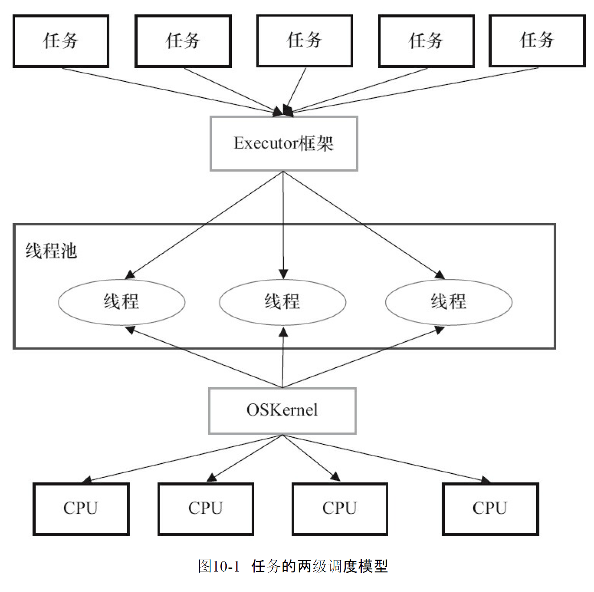

# Executor框架

## Executor框架简介

### Executor框架的两级调度模型

在HotSpot VM的线程模型中Java线程(java.lang.Thread)被一对一映射为本地操作系统线程.Java线程启动时会创建一个本地操作系统线程;当该Java线程终止时,这个操作系统线程也会被回收.操作系统会调度所有线程并将他们分配给可用的CPU

在上层,Java多线程程序通常把应用分解为若干个任务,然后使用用户级的调度器(Executor框架)将这些人物映射为固定数量的线程;在底层,操作系统内核将这些线程映射到硬件处理器上

应用程序通过Executor框架控制上层的调度;而下层的调度由操作系统内核控制,下层的调度不受应用程序的控制.

### Executor框架的结构与成员

Executor的结构和Executor框架包含的成员组件



* Executor框架结构
  * 任务: 包括被执行任务需要实现的接口:Runnable接口或Callable接口
  * 任务的执行:包括任务执行机制的核心接口Executor,以及继承自Executor的ExecutorService接口.Executor框架由两个关键类实现了ExecutorService接口(ThreadPoolExecutor和ScheduledThreadPoolExecutor)
  * 异步计算的结果:包括结构Future接口和实现Future接口的FutureTask类


* Executor接口,它是Executor框架的基础,它将任务的提交与任务的执行分离开
* ThreadPoolExecutor时线程池的核心实现类,用来执行被提交的任务
* ScheduledThreadPoolExecutor是一个实现类,可以在给定的延迟后运行命令,或者定期执行命令.ScheduledThreadPoolExecutor比Timer更灵活,功能更强大
* Future接口和实现Future接口的FutureTask类,代表异步计算的结果
* Runnable接口和Callable接口的实现,都可以被ThreadPoolExecutor或ScheduledThreadPoolExecutor执行


主线程首先创建实现Runnable或者Callable接口的任务对象.工具类Executors可以把一个Runnable对象封装为一个Callable对象(`Executors.callable(Runnable tast)`或`Executors.callable(Runnable task,Object result)`)

然后可以把Runnable对象直接交给ExecutorService执行(`ExecutorService.execute(Runnable command)`);或者也可以把Runnable对象或Callable对象提交给ExecutorService执行(`ExecutorService.submit(Runnable task)`或`ExecutorService.submit(Callable<T> task)`)

如果执行`ExecutorService.submit(...)`ExecutorService将会返回一个实现Future接口的对象(目前为止是FutureTask).由于FutureTask实现了Runnable,也可以直接创建FutureTask,然后交给ExecutorService执行

最后,主线程可以执行`FutureTask.get()`方法来等待任务执行完成.主线程也可以执行`FutureTask.cancel(boolean mayInterruptIfRunning)`来取消此任务的执行

* Executor框架的成员

1. ThreadPoolExecutor
  ThreadPoolExecutor通常使用工厂类Executors来创建.Executors可以创建3中类型的ThreadPoolExecutor: SingleThreadExecutor, FixedThreadPool 和CachedThreadPool
  1.1. FixedThreadPool 

  ```java
      /**
       * Creates a thread pool that reuses a fixed number of threads
       * operating off a shared unbounded queue.  At any point, at most
       * {@code nThreads} threads will be active processing tasks.
       * If additional tasks are submitted when all threads are active,
       * they will wait in the queue until a thread is available.
       * If any thread terminates due to a failure during execution
       * prior to shutdown, a new one will take its place if needed to
       * execute subsequent tasks.  The threads in the pool will exist
       * until it is explicitly {@link ExecutorService#shutdown shutdown}.
       *
       * @param nThreads the number of threads in the pool
       * @return the newly created thread pool
       * @throws IllegalArgumentException if {@code nThreads <= 0}
       */
      public static ExecutorService newFixedThreadPool(int nThreads) {
          return new ThreadPoolExecutor(nThreads, nThreads,
                                        0L, TimeUnit.MILLISECONDS,
                                        new LinkedBlockingQueue<Runnable>());
      }
  ```

  ```java
      /**
       * Creates a thread pool that reuses a fixed number of threads
       * operating off a shared unbounded queue, using the provided
       * ThreadFactory to create new threads when needed.  At any point,
       * at most {@code nThreads} threads will be active processing
       * tasks.  If additional tasks are submitted when all threads are
       * active, they will wait in the queue until a thread is
       * available.  If any thread terminates due to a failure during
       * execution prior to shutdown, a new one will take its place if
       * needed to execute subsequent tasks.  The threads in the pool will
       * exist until it is explicitly {@link ExecutorService#shutdown
       * shutdown}.
       *
       * @param nThreads the number of threads in the pool
       * @param threadFactory the factory to use when creating new threads
       * @return the newly created thread pool
       * @throws NullPointerException if threadFactory is null
       * @throws IllegalArgumentException if {@code nThreads <= 0}
       */
      public static ExecutorService newFixedThreadPool(int nThreads, ThreadFactory threadFactory) {
          return new ThreadPoolExecutor(nThreads, nThreads,
                                        0L, TimeUnit.MILLISECONDS,
                                        new LinkedBlockingQueue<Runnable>(),
                                        threadFactory);
      }
  ```

  FixedThreadPool适用于为了满足资源管理的需求,需要线程当前线程数量的应用场景,它适用于负载比较重的服务器
  1.2. SingleThreadExecutor.

  ```java
      /**
       * Creates an Executor that uses a single worker thread operating
       * off an unbounded queue. (Note however that if this single
       * thread terminates due to a failure during execution prior to
       * shutdown, a new one will take its place if needed to execute
       * subsequent tasks.)  Tasks are guaranteed to execute
       * sequentially, and no more than one task will be active at any
       * given time. Unlike the otherwise equivalent
       * {@code newFixedThreadPool(1)} the returned executor is
       * guaranteed not to be reconfigurable to use additional threads.
       *
       * @return the newly created single-threaded Executor
       */
      public static ExecutorService newSingleThreadExecutor() {
          return new FinalizableDelegatedExecutorService
              (new ThreadPoolExecutor(1, 1,
                                      0L, TimeUnit.MILLISECONDS,
                                      new LinkedBlockingQueue<Runnable>()));
      }
  ```

  ```java
      /**
       * Creates an Executor that uses a single worker thread operating
       * off an unbounded queue, and uses the provided ThreadFactory to
       * create a new thread when needed. Unlike the otherwise
       * equivalent {@code newFixedThreadPool(1, threadFactory)} the
       * returned executor is guaranteed not to be reconfigurable to use
       * additional threads.
       *
       * @param threadFactory the factory to use when creating new
       * threads
       *
       * @return the newly created single-threaded Executor
       * @throws NullPointerException if threadFactory is null
       */
      public static ExecutorService newSingleThreadExecutor(ThreadFactory threadFactory) {
          return new FinalizableDelegatedExecutorService
              (new ThreadPoolExecutor(1, 1,
                                      0L, TimeUnit.MILLISECONDS,
                                      new LinkedBlockingQueue<Runnable>(),
                                      threadFactory));
      }
  ```

  SingleThreadExecutor适用于需要保证顺序执行各个任务;并且在任意时间点,不会有多个线程是活动的应用场景

  1.3. CachedThreadPool

  ```java
      /**
       * Creates a thread pool that creates new threads as needed, but
       * will reuse previously constructed threads when they are
       * available.  These pools will typically improve the performance
       * of programs that execute many short-lived asynchronous tasks.
       * Calls to {@code execute} will reuse previously constructed
       * threads if available. If no existing thread is available, a new
       * thread will be created and added to the pool. Threads that have
       * not been used for sixty seconds are terminated and removed from
       * the cache. Thus, a pool that remains idle for long enough will
       * not consume any resources. Note that pools with similar
       * properties but different details (for example, timeout parameters)
       * may be created using {@link ThreadPoolExecutor} constructors.
       *
       * @return the newly created thread pool
       */
      public static ExecutorService newCachedThreadPool() {
          return new ThreadPoolExecutor(0, Integer.MAX_VALUE,
                                        60L, TimeUnit.SECONDS,
                                        new SynchronousQueue<Runnable>());
      }
  ```

  ```java
    /**
       * Creates a thread pool that creates new threads as needed, but
       * will reuse previously constructed threads when they are
       * available, and uses the provided
       * ThreadFactory to create new threads when needed.
       * @param threadFactory the factory to use when creating new threads
       * @return the newly created thread pool
       * @throws NullPointerException if threadFactory is null
       */
      public static ExecutorService newCachedThreadPool(ThreadFactory threadFactory) {
          return new ThreadPoolExecutor(0, Integer.MAX_VALUE,
                                        60L, TimeUnit.SECONDS,
                                        new SynchronousQueue<Runnable>(),
                                        threadFactory);
      }
  ```

  CachedThreadPool是一个无界线程池,适用于执行很多短期异步的小程序,或者是负载较轻的服务器

  2. ScheduledThreadPoolExecutor

  ScheduledThreadPoolExecutor通常使用工厂类Executors来创建.Executors可以创建2中类型的ScheduledThreadPoolExecutor

  * ScheduledThreadPoolExecutor 包含若干个线程的ScheduledThreadPoolExecutor 适用于多个后台线程执行周期性任务,同时为了满足资源管理的需求而需要限制后台线程数量的应用场景
  * SingleThreadScheduledExecutor 只包含一个线程的ScheduledThreadPoolExecutor 适用于需要单个后台线程执行周期任务,同时涂药保证顺序执行各个任务的应用场景

  3. Future接口

  Future接口和实现Future接口的FutureTask类用来表示异步计算的结果.当我们把Runnable接口或Callable接口的实现类提交(submit)给ThreadPoolExecutor或ScheduledThreadPoolExecutor时,ThreadPoolExecutor或ScheduledThreadPoolExecutor会向我们返回一个FutureTask对象

  ```java
      /**
       * Submits a value-returning task for execution and returns a
       * Future representing the pending results of the task. The
       * Future's {@code get} method will return the task's result upon
       * successful completion.
       *
       * <p>
       * If you would like to immediately block waiting
       * for a task, you can use constructions of the form
       * {@code result = exec.submit(aCallable).get();}
       *
       * <p>Note: The {@link Executors} class includes a set of methods
       * that can convert some other common closure-like objects,
       * for example, {@link java.security.PrivilegedAction} to
       * {@link Callable} form so they can be submitted.
       *
       * @param task the task to submit
       * @param <T> the type of the task's result
       * @return a Future representing pending completion of the task
       * @throws RejectedExecutionException if the task cannot be
       *         scheduled for execution
       * @throws NullPointerException if the task is null
       */
      <T> Future<T> submit(Callable<T> task);
  
      /**
       * Submits a Runnable task for execution and returns a Future
       * representing that task. The Future's {@code get} method will
       * return the given result upon successful completion.
       *
       * @param task the task to submit
       * @param result the result to return
       * @param <T> the type of the result
       * @return a Future representing pending completion of the task
       * @throws RejectedExecutionException if the task cannot be
       *         scheduled for execution
       * @throws NullPointerException if the task is null
       */
      <T> Future<T> submit(Runnable task, T result);
  
      /**
       * Submits a Runnable task for execution and returns a Future
       * representing that task. The Future's {@code get} method will
       * return {@code null} upon <em>successful</em> completion.
       *
       * @param task the task to submit
       * @return a Future representing pending completion of the task
       * @throws RejectedExecutionException if the task cannot be
       *         scheduled for execution
       * @throws NullPointerException if the task is null
       */
      Future<?> submit(Runnable task);
  ```

  4. Runnable接口和Callable接口


## ThreadPoolExecutor详解

