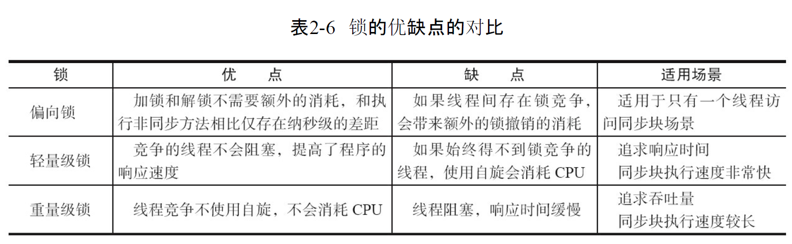

# Java并发机制的底层实现原理

## volatile的定义与实现原理

volatile:

> Java编程语言允许线程访问共享变量,为了确保共享变量能被准确和一致地更新,线程应该确保通过排他锁单独获得这个变量.

| 术语       | 英文单词               | 属于描述                                                     |
| :--------- | ---------------------- | ------------------------------------------------------------ |
| 内存屏障   | memory barriers        | 一组处理器指令,用于实现对于内存操作的顺序限制                |
| 缓冲行     | cache line             | 缓存中可以分配的最小存储单位. 处理器填写缓存线时会加载整个缓存线,需要使用多个主内存读周期 |
| 原子操作   | atomic operations      | 不可中断的一个或一系列操作                                   |
| 缓存行填充 | cache line fill        | 当处理器识别到内存中读取操作数时可缓存的,处理器读取整个缓存行到适当的缓存(L1,L2,L3的或所有) |
| 缓存命中   | cache hit              | 如果进行高速缓存行填充操作的内存位置仍然时下次处理器访问的地址时,处理器从缓存中读取操作,而不是从内存中 |
| 写命中     | write hit              | 当处理器将操作数写回到一个内存缓存的区域时,首先检查这个缓存的内存地址是否在缓存行中,如果存在一个有效的缓存行,则处理器将这个操作数写回到缓存,而不是写回到内存,这个操作被称为写命中 |
| 写缺失     | write misses the cache | 一个有效的缓存行被写入到不存在的内存区域                     |

> Lock前缀的指令在多核处理器下会引发两件事
>
> * 将当前处理器缓存行的数据写回到系统内存
>
> * 这个写回内存的操作会使在其他cup里缓存了改内存地址的数据无效
>
>   为了提高处理速度,处理器不直接和内存进行同行,而是先将系统内存的数据读到内部缓存(L1,L2或其他)后再进行操作,但操作完不知道何时会写到内存. 如果对声明了volatile的变量进行写操作, JVM就会向处理器发送一条Lock前缀的指令, 将这个变量所在缓存行的数据写回到系统内存. 但是, 就算写回到内存, 如果其他处理器缓存的值还是旧的, 再执行计算操作就会有问题. 所以, 在多处理器下, 为了保证各个处理器的缓存是一致的, 就会实现缓存的一致性协议, 每个处理器通过嗅探在总线上传播的数据来检查自己缓存的值是不是过期了, 当处理器发现自己缓存行对应的内存地址被修改, 就会将当前处理器的缓存行设置成无效状态, 当处理器对这个数据进行修改操作的时候, 会重新从内存中把数据读到处理器缓存中

volatile的两条实现原则

* Lock前缀指令会引起处理器缓存会写到内存

> Lock前缀指令导致在执行指令期间, 声言处理器的LOCK#信号. 在多处理器环境中,LOCK#信号确保在声言该信号期间, 处理器可以独占任何共享内存. 但是, 在最近的处理器中, Lock#信号一般不锁总线, 而是锁缓存, 毕竟锁总线开销比较大. 对于Intel486和Pentium处理器, 在锁操作时, 总是在总线上声言LOCK# 信号. 但在P6和目前的处理器中, 如果访问的内存区域已经缓存在处理器内部, 则不会声言LOCK#信号. 相反, 他会锁定这块内存区域的缓存并会写道内存, 并使用缓存一致性机制来确保修改的原子性, 此操作被称为'缓存锁定', 缓存一致性机制会阻止同时修改两个以上处理器缓存的内存区域数据

* 一个处理器的缓存会写道内存会导致其他处理器的缓存无效

> IA-32处理器和Intel 64处理器使用MESI(修改[modified],独占[Exclusive],共享[Shared],无效[Invalid])控制协议取维护内部缓存和其他处理器缓存的一致性. 在多核处理器系统中进行操作的时候, IA-32和Intel 64处理器能嗅探到其他处理器访问系统内存和他们的内部缓存. 处理器使用嗅探技术保证他的内部缓存,系统内存和其他处理器的缓存的数据在总线上保持一致

## volatile的使用优化

为什么追加64字节能够提高并发编程的效率

对于英特尔酷睿i7、酷睿、Atom和 NetBurst，以及Core Solo和Pentium M处理器的L1,L2,或L3缓存的高速缓存行是64个字节宽,不支持部分填充缓存行, 这意味着, 如果队列的头节点和为节点都不足64字节的话,处理器会将他们都读到一个高速缓存中, 在多处理器下每个处理器都会缓存同样的头.尾节点,当一个处理器试图修改头节点时,会将整个缓存行锁定,那么在缓存一致性机制的作用下,会导致其他处理器不能访问自己高速缓存中的尾节点,而队列的入队和出队操作则需要不停修改头节点和尾节点, 所以在多处理器的情况下会严重影响到队列的入队和出对效率.Douglea使用追加到64字节的方式来填满高速缓存行,避免头节点和尾节点加载到同一缓存行,使头尾节点在修改时不会互相锁定

有两种场景下不应该使用这种方式

* 缓存行非64字节宽的处理器.如P6系列和奔腾处理器,他们的L1,和L2高速缓存行时32个字节宽
* 共享变量不会被频繁地写.因为使用追加字节的方式需要处理器读取更多的字节到达高速缓存,这本身就会带来一定的性能消耗,如果共享变量不被频繁写的话,锁的机率也非常小,就没有需要追加字节的方式来避免互相锁定

## synchronized 的实现原理与应用

Java中的每一个对象都可以作为锁

* 对于普通同步方法,锁是当前实例对象
* 对于静态同步方法,锁是当前类的Class对象
* 对于同步方法快,锁是Synchronized括号里配置的对象

当一个线程试图访问同步代码块时,它首先必须得到锁,退出或抛出异常时必须释放锁.那么锁到底存在哪里?锁里面会存储什么信息?

JVM基于进入和退出Monitor对象来实现方法同步和代码块同步,但两者的实现细节不一样. 代码块同步是使用monitorenter和monitorexit指令实现的, 而方法同步是使用另外一种实现方式, 细节在JVM规范里并没有详细说明. 但方法同步也可以使用这两个指令来实现

monitorenter指令时在编译后插入到同步代码块的开始位置,而monitorexit是插入到方法结束出和异常处, JVM要保证每个monitorenter必须有对应的monitorexit与之配对. 任何对象都有一个monitor与之关联, 当且一个monitor被持有后, 它将处于锁定状态. 线程执行到monitorenter指令时, 将会尝试获取对象所对应的monitor的所有权, 即尝试获取对象的锁.

### Java对象头

synchronized用的锁时存在java对象头里面的. 如果对象是数组类型, 则虚拟机用3个字节宽(word)存储对象头, 如果对象是非数组类型, 则用2字宽存储对象头. 在32位虚拟机中, 1字宽等于4字节32bit

Java对象头的长度

| 长度     | 内容                   | 说明                           |
| -------- | ---------------------- | ------------------------------ |
| 32/64bit | Mark Word              | 存储对象的或锁信息等           |
| 32/64bit | Class Metadata Address | 存储到对象类型数据的执政       |
| 32/32bit | Array length           | 数组的长度(如果当前对象是数组) |

Java对象头里面的Mark Word默认存储对象的HashCode,分代年龄和锁标记为. 

32位JVM的Mark Word的默认存储结构如下

| 锁状态   | 25bit          | 4bit         | 1bit 是否是偏向锁 | 2bit 锁标志位 |
| -------- | -------------- | ------------ | ----------------- | ------------- |
| 无锁状态 | 对象的hashCode | 对象分代年龄 | 0                 | 01            |

在运行期间, Mark Word里存储的数据会随着锁标志位的变化而变化. Mark Word 可能变化为存储一下四种数据

Mark Word的状态变化


64位虚拟机下, Mark Word是64bit大小的,其存储结构如下:

Mark Word的存储结构


### 锁的升级与对比

JSE1.6为了减少获得和释放锁带来的性能消耗, 引入了"偏向锁"和"轻量级锁", 在JSE1.6中, 锁一共有4中状态, 级别从低到高依次是: 无锁状态, 偏向锁状态, 轻量级锁状态, 重量级锁状态, 这几个状态会随着竞争情况逐渐升级. 锁可以升级但不能降级. 这种锁升级却不能降级的策略, 目的是为了提高获得锁和释放锁的效率

* 偏向锁

  > 大多数情况下, 锁不仅不存在多线程竞争, 而且总是由同一线程多次获得, 为了让线程获得锁的代价更低而引入了偏向锁. 当一个线程访问同步快并获取锁时, 会在对象头和栈帧中的锁记录里存储锁偏向的线程ID, 以后该线程在进入和退出同步块时就不需要进行CAS操作来加锁和解锁, 只需要简单地测试一下对象头的Mark Word里是否存储着指向当前线程的偏向锁,如果测试成功,表示线程已经获得了锁,如果失败,则需要载测试一下Mark Word中偏向锁的标识是否设置成1(表示当前是偏向锁):如果没有设置,则使用CAS竞争锁;如果设置了,则尝试使用CAS将对象头的偏向锁指向当前线程

  * 偏向锁的撤销

    > 偏向锁使用了一种等到竞争出现才释放锁的机制, 当其他线程尝试竞争偏向锁时,持有偏向锁的线程才会释放锁.偏向锁的撤销,需要等待全局安全点(在这个时间点上没有正在执行的字节码).他会首先暂停拥有偏向锁的线程,然后检查持有偏向锁的线程是否活着,如果线程不处于活动状态,则将对象头设置成无锁状态;如果线程仍然活着,拥有偏向锁的栈会被执行,遍历偏向对象的锁记录,栈中的锁记录和对象头的Mark Word要么重新偏向于其他线程,要么回复到无锁或标记对象不适合作为偏向锁,最后唤醒暂停的线程.下图时偏向锁的初始化流程和撤销流程
    >
    > 

  * 关闭偏向锁

    > 偏向锁在Java6和之后时默认开启的,但他在应用程序启动几秒钟之后才会激活,如果有必要可以使用JVM参数来关闭延迟:`-XX:BiasedLockingStratupDelay=0` 如果确定应用程序里所有的锁通常情况下处于竞争状态,可以通过JVM参数关闭偏向锁`-XX:-UseBiasedLocking = false`

* 轻量级锁

  * 轻量级锁加锁

    > 线程在执行同步块之前,JVM会先在当前线程的栈帧中创建用于存储锁记录的空间,并将对象头中的Mark Word复制到锁记录中,官方称为Displaced Mark Word. 然后线程尝试使用CAS将对象头中的Mark Word替换为指向锁记录的指针. 如果成功, 当前线程获得锁,如果失败,表示其他线程竞争锁,当前线程便尝试使用自旋来获取锁

  * 轻量级锁解锁

    > 轻量级解锁时,会使用原子的CAS操作将Displaced Mark Word替换回到对象头, 如果成功,则表示没有竞争发生. 如果失败,表示当前锁存在竞争, 锁就会膨胀成重量级锁
    >
    > 
    >
    > 	因为自旋会消耗CPU,为了避免无用的自旋(比如获得锁的线程被阻塞住了),一旦锁升级成重量级锁,就不会再恢复到轻量级锁状态. 当锁处于这个状态下,其他线程试图获取锁时,都会被阻塞,当持有锁的线程释放锁后,会唤醒这些线程,被唤醒的线程就会进行新一轮的锁竞争

* 锁的优缺点比较

  

## 原子操作的实现原理

* 术语定义

| 术语名称     | 英文                   | 解释                                                         |
| ------------ | ---------------------- | ------------------------------------------------------------ |
| 缓存行       | Cache line             | 缓存的最小操作单位                                           |
| 比较并交换   | Compare and Swap       | CAS操作需要输入两个数值,一个旧值(期望操作前的值)和一个新值,在操作期间先比较旧值有没有发生变化,如果没有,才交换成新值,发生了变化则不交换 |
| CPU流水线    | CPU pipeline           | CPU流水线的工作方式就像工业生产上的装配流水线,在CPU中由5-6个不同功能的电路单员组成一条指令处理流水线,然后将一条X86指令分成5-6步后再由这些电路单元分别执行,这样就能实现在一个CPU时钟周期完成一条指令,因此提高CPU的运算速度 |
| 内存顺序冲突 | Memory order violation | 内存顺序冲突一盘是由假共享引起的,假共享是指多个CPU同时修改同一个缓存行的不同部分而引起其中一个CPU的操作无效,当出现这个内存顺序冲突时,CPU必须清空流水线 |

* 处理器如何实现原子操作

  > 32位IA-32处理器使用基于对缓存加锁或总线加锁的方式来实现多处理器之间的原子操作. 首先处理器会自动保证基本的内存操作的原子性. 处理器保证从系统内存中读取或写入一个字节时原子的, 意思是当一个处理器读取一个字节时,其他处理器不能访问这个字节的内存地址. Pentium6和最新的处理器能自动保证单处理器对同一缓存行里进行16/32/64位的操作时原子的, 但是复杂的内存操作处理器是不能自动保证其原子性的, 比如 跨总线宽度,跨多个缓存行和跨页表的访问. 但是,处理器提供总线锁定和缓存锁定两个机制来保证复杂内存操作的原子性

  * 使用总线锁保证原子性	 

    >第一个机制是通过总线锁保证原子性. 如果多个处理器同时对共享变量进行度改写(i++就是经典的读改写操作)那么共享变量就会被多个处理器同时进行操作,这样读改写操作就不是原子性的,操作完成之后共享变量的值会和期望的值不一样

  * 使用缓存锁保证原子性

    > 第二个机制是通过缓存锁定来保证原子性. 在同一时刻,我们只需要保证对某个内存地址的操作是原子性即可.但总线锁定把CPU和内存之间的通信锁住了,这使得锁定期间,其他处理器不能操作其他内存地址的数据,所以总线锁定的开销比较大,目前处理器在某些场合下使用缓存锁定带起总线锁定来进行优化
    >
    > 	频繁使用的内存会缓存到处理器的L1,L2,L3告诉缓存中,那么原子操作就可以直接在处理器内部缓存中进行,并不需要声明总线锁,在Pentium6和目前的处理器中可以使用"缓存锁定"的方式来实现复杂的原子性. 所谓"缓存锁定"是指内存区域如果被缓存在处理器的缓存行中,并且在Lock操作期间被锁定,那么当它执行行锁操作回写到内存时,处理器不在总线上声言LOCK#信号,而是修改内部的存储地址,并允许它的缓存一致性机制来保证原子操作,因为缓存一致性机制会阻止同时修改由两个以上处理器缓存的内存区域数据,当其他处理器回写已被锁定的缓存行数据时,会使缓存无效
    >
    > **有两种情况下处理器不会使用缓存锁定**
    >
    > * 当操作的数据不能被缓存在处理器内部,或操作的数据跨多个缓存行(Cache line)时,处理器会调用总线锁定
    > * 有些处理器不支持缓存锁定

  针对以上两种机制,我们通过Intel处理器提供了很多Lock前缀的指令来实现, 位测试和修改指令: BTS,BTR,BTC;交换指令 XADD,CMPXCHG,以及其他一些操作数和逻辑指令(ADD,OR)等,被这些指令操作的内存区域就会加锁,导致其他处理器不能同时访问

* Java如何实现原子操作

  > **在Java中可以通过锁和循环CAS的方式来实现原子操作**
  >
  > * 使用循环CAS实现原子操作
  >
  > JVM中的CAS操作利用了处理器提供的CMPXCHG指令实现.自旋CAS实现的基本思路就是循环进行CAS操作,直至成功为止

* CAS实现原子操作的三大问题

  ABA问题

  循环时间长开销大

  只能保证一个共享变量的原子操作

  * ABA问题

  > 因为CAS需要在操作值的时候检查值有没有发生变化,如果没有发生变化则更新,但是如果一个值原来是A,变成了B,又变成了A,那么使用CAS进行检查就会发现它的值没有发生变化,但实际上是变化过的.ABA的解决思路就是添加版本号,在变量前面追加上版本号,每次变量更新版本号自增.JDK 的Atomic包提供AtomicStampedReference类来解决ABA问题,该类的compareAndSet方法首先检查当前引用是否等于预期引用,并检查当前标志是否等于预期标识,如果全部相等,则原子性的更新引用和标识
  >
  > ```java
  > //数据包 
  > private volatile Pair<V> pair;
  > private static class Pair<T> {
  >         final T reference;
  >         final int stamp;
  >         private Pair(T reference, int stamp) {
  >             this.reference = reference;
  >             this.stamp = stamp;
  >         }
  >         static <T> Pair<T> of(T reference, int stamp) {
  >             return new Pair<T>(reference, stamp);
  >         }
  >     }
  > 
  > 
  > /**
  >      * Atomically sets the value of both the reference and stamp
  >      * to the given update values if the
  >      * current reference is {@code ==} to the expected reference
  >      * and the current stamp is equal to the expected stamp.
  >      *
  >      * @param expectedReference the expected value of the reference
  >      * @param newReference the new value for the reference
  >      * @param expectedStamp the expected value of the stamp
  >      * @param newStamp the new value for the stamp
  >      * @return {@code true} if successful
  >      */
  >     public boolean compareAndSet(V   expectedReference,
  >                                  V   newReference,
  >                                  int expectedStamp,
  >                                  int newStamp) {
  >         Pair<V> current = pair;
  >         return
  >             expectedReference == current.reference &&
  >             expectedStamp == current.stamp &&
  >             ((newReference == current.reference &&
  >               newStamp == current.stamp) ||
  >              casPair(current, Pair.of(newReference, newStamp)));
  >     }
  > ```
  >

  * 循环时间长开销大

  > 自旋CAS如果如果长时间不成功,会给CPU带来非常大的执行开销. 如果JVM能支持处理器提供大的pause指令,那么效率会有一定的提升. pause指令有两个作用: 第一,它可以延迟流水线执行指令(de-pipeline), 是CPU不会消耗过多的执行资源, 延迟的事件取决于具体实现的版本, 再一些处理器上 延迟时间是零; 第二, 他可以避免在退出循环的时候因内存顺序冲突(Memory Order Violation)而因此CPU流水线被清空(CPU pipeline Flush) 从而提高CPU的执行效率

  * 只能保证一个共享变量的原子操作

  > 当对一个共享变量执行操作时, 我们可以使用循环CAS的方式来保证原子操作, 但是对于多个共享变量操作时, 循环CAS就无法保证操作的原子性了,这个时候就可以用锁. 还有一个取巧的方法, 就是把多个共享变量合并成一个共享变量来操作 自Java 1.5之后 JDK提供AtomicReference类来保证引用对象之间的原子性,就可以把多个变量放在一个对象里来进行CAS操作

* 使用锁机制实现原子操作

  锁机制保证了只有获得锁的线程才能够操作锁定的内存区域. JVM内部实现了很多种锁机制, 有偏向锁,轻量级锁 和互斥锁. 除了偏向锁 JVM实现锁的方式都用了循环CAS, 即当一个线程想进入同步块的时候使用循环CAS的方式来获取锁, 当它退出的时候使用循环CAS释放锁

   