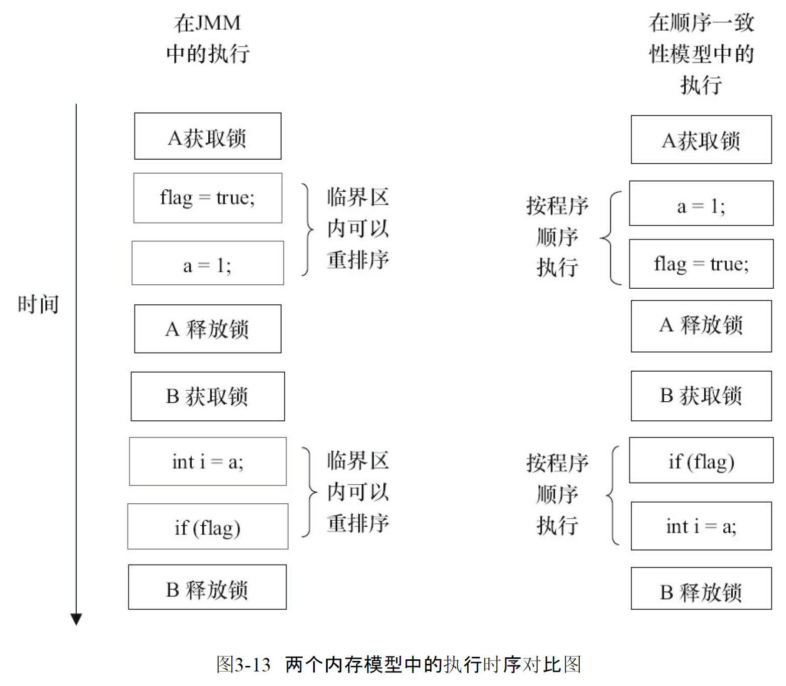
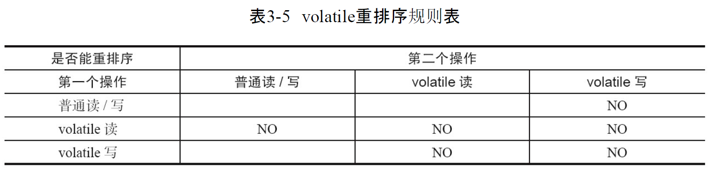

# Java 内存模型

本章主要有 

* Java内存模型的基础
* Java内存模型中的顺序一致性
* 同步原语
* Java内存模型的设计

## Java内存模型的基础

### 并发编程模型的两个关键问题

在并发编程中,需要处理两个关键问题:

	线程之间如何通信
	
	线程之间如何同步

通信是指线程之间以何种机制来交换信息,在命令之编程中,线程之间的通信机制有两种: 共享内存和消息传递

	在共享内存的并发模型中,线程之间共享程序的公共状态,通过读写内存中的公共状态进行隐式通信. 在消息传递的并发模型里, 线程之间没有公共状态, 线程之间必须通过发送消息来显示通信
	
	同步是指程序中用于控制不同线程间操作发成相对顺序的机制. 在共享内存并发模型中, 同步是显示进行的. 程序员必须显式指定某个方法或某段代码需要在线程之间 互斥执行. 在消息传递的并发模型里, 由于消息的发送必须在消息的接收之前 , 因此同步是隐式的
	
	Java的并发采用的是共享内存模型, Java线程之间通信总是隐式的, 整个通信过程对程序员完全透明. 

### Java内存模型的抽象结构

	在Java中所有实例域,静态域和数组元素都存在堆内存中, 堆内存在线程之间共享. 局部变量(Local Variables), 方法定义参数(Java语言规范惩治位 Formal Method Parameters)和异常处理器参数(ExceptionHandler Parameters)不会在线程之间共享, 他们不会有内存可见性问题 也不受内存模型的影响
	
	java线程之间的通信有Java内存模型(JMM)控制,JMM决定一个线程对共享变量的写入何时对另一个线程可见. 从抽象的角度来看, JMM定义了线程和主内存之间的抽象关系: 线程之间的共享变量存储在主内存(Main Memory)中,每个线程都有一个私有的本地内存(Local Memory), 本地内存中存储了该线程以读写共享变量的副本. 本地内存是JMM的一个抽象概念, 并不真实存在. 它涵盖了缓存,写缓冲取,寄存器以及其他的硬件和编译器优化.

如上图 如果线程A与线程B进行通信,必须经历以下两步

* 线程A把本地内存A中更新过的共享变量刷新到主内存中去
* 线程B到主内存中去读取A之前已经更新过的共享变量

从整体上看,这两步实质上是线程A在向线程B发送消息, 而且这个通信过程必须要经过主内存.JMM通过控制主内存与每个线程的本地内存之间的交互,来为Java程序员提供内存可见性保证

### 从源代码到指令序列的重排序

在执行程序时,为了提高性能,编译器和处理器常常会对指令做重排序

* 编译器优化的重排序. 编译器在不改变单线程程序语义的前提下,可以重新安排语句的执行顺序

* 指令级并行的重排序.现代处理器采用了指令级并行技术(Instruction-Level Parallelism, ILP)来将多条指令重叠执行. 如果不存在数据依赖性, 处理器可以改变语句对应机器指令的执行顺序

* 内存系统的重排序. 由于处理器使用缓存和读/写缓冲区, 这使得加载和存储操作看上去可能是在乱序执行

  从Java源代码最终实际执行的指令序列,会进行以下重排

  

StoreLoad Barriers是一个'全能型'的屏障 ,它同时具有其他三个屏障的效果. 现代的多处理器大多支持该屏障(其他类型的屏障不一定被所有处理器支持). 执行该屏障开销会很昂贵, 因为当前处理器通常要把写缓冲区中的数据全部刷星到内存中(Buffer Fully Flush)

### happens-before 简介

在JMM中如果一个操作执行的结果需要对另一个操作可见, 那么这两个操作之间必须要存在 happens-before关系,这两个操作既可以是在一个线程中,也可以在不同的线程间

程序顺序规则: 一个线程中的每个操作,happens-before于该线程中的任意后续操作

监视器锁定规则: 对于一个锁解锁, happens-before于随后对这个锁的加锁.

volatile变量规则: 对一个volatile域的写 happens-before 于任意后续对这个volatile域的读

传递性: A happens-before B B happens-before C 则 A happens-before C

## 重排序

重排序是指编译器和处理器为了优化程序性能而对指令进行重排序的一种手段

### 数据依赖性

	如果两个操作访问同一个变量, 并且两个操作有一个为写操作, 此时这两个操作之间就存在数据依赖性. 数据依赖性分为以下三种

这三种情况下 只要重排序两个操作的执行顺序, 程序的执行结果就会改变, 编译器和处理器在重排序时,会遵循数据依赖性, 不会改变存在数据依赖关系的两个操作的执行顺序

这仅针对单个处理器中执行的指令序列和单个线程中执行的操作,不同处理器之间和不同线程之间的数据依赖性不被编译器和处理器考虑

### as-if-serial语义

不管怎么重排序(编译器和处理器为了提高并行度),(单线程)程序的执行结果不能被改变. 编译器,runtime和处理器都必须遵守as-fi-serial语义

### 程序顺序规则

### 重排序对多线程的影响

在单线程程序中,对存在控制依赖的操作重排序,不会改变执行结果;但在多线程程序中,对存在控制依赖的操作做重排序,可能会改变程序的执行结果

## 顺序一致性

### 数据竞争与顺序一致性

当程序未正确同步时,就可能会存在数据竞争. Java内存模型规范对数据竞争的定义如下

* 在一个线程中写一个变量
* 在另一个线程读同一个变量
* 写和读没有通过同步来排序

JMM对正确同步的多线程程序的内存一致性做了如下保证:

	如果程序是正确同步的,程序的执行将具有顺序一致性(Sequentially Consistent)--即程序的执行结果与该程序在顺序一致性内存模型中的执行结果相同.

### 顺序一致性内存模型

### 同步程序的顺序一致性效果

	顺序一致性模型中,所有操作完全按照程序的顺序串行执行. 而在JMM中 临界区内的代码可以重排序(但JMM不允许临界区内的代码 *逸出* 到临界区之外 那样会破坏监视器的语义). JMM会在退出临界区和进入临界区这两个关键时间点做一些特别处理, 是的线程在这两个时间点具有与顺序一致性模型相同的内存视图. 虽然线程A在临界区内做了重排序, 但由于监视器互斥执行的特性,这里的线程B无法观察到线程A在临界区内的重排序. 这种重排序即提高了执行效率, 也没有改变程序的执行结果

JMM在具体实现上的基本方针为:在不改变(正确同步)程序执行结果的前提下, 尽可能为编译器和处理器的优化打开方便之门

### 未同步程序的执行特性

	对于未同步或未正确同步的多线程程序, JMM只提供最小安全性: 线程执行时读取到的值, 要么是之前某个线程写入的值, 要么是默认值(0,Null,False), JMM保证线程读操作读取到的值不会无中生有(Out of Thin Air)的冒出来. 为了实现最小安全性, JVM在堆上分配对象时, 首先会对内存空间进行清零, 然后才会在上面分配对象(JVM内部会同步这两个操作) 因此, 在已清零的内存空间(Pre-zeroed Memory)分配对象时, 域的默认初始化已经完成了
	
	JMM不保证位同步程序的执行结果与该程序在顺序一致性模型中的执行结果一致. 因为如果要保证执行结果一致, JMM需要禁止大量的处理器与编译器的优化, 这对程序的执行性能会产生很大的影响. 而且未同步程序在顺序一致性模型中执行时, 整体是无序的, 其执行结果往往无法预知, 而且, 保证未同步程序在这两个模型中的执行结果一致没什么意义
	
	未同步程序在JMM中的执行时,整体上是无序的, 其执行结果无法预知. 未同步程序在两个模型中的执行特性有如下差异

* 顺序一致性模型保证单线程内的操作会按照程序的顺序执行, 而JMM不保证单线程内的操作会按照程序的顺序执行(正确同步的多线程程序在临界区内的重排序)

* 顺序一致性模型保证所有线程只能看到一致的操作执行顺序,而JMM不保证所有线程能看到一致的执行顺序

* JMM不保证对64位的long型和double型变量的写操作具有原子性,而顺序一致性模型保证对所有内存读/写操作都具有原子性

  > 第三个差异与处理器总线的工作机制密切相关, 在计算机中, 数据通过总线在处理器和内存之间传递, 每次处理器和内存之间的数据传递都是通过一系列步骤来完成的, 这一系列步骤称之为总线事务(Bus Transaction). 总线事务包括读事务(Read Transaction)和写事务(Read Transaction).读事务从内存传递数据到处理器, 写事务从处理器传送数据到内存, 每个事务会读/写内存中一个或多个物理上连续的字. 这里的关键是, 总线会同步试图并发使用总线的事务. 在处理器执行总线事务期间, 总线会禁止其他的处理器和I/O设备执行内存的读/写
  >
  > 
  >
  > 由图可知,假设ABC同时向总线发起总线事务, 这时 总线仲裁(Bus Arbitration)会对竞争做出裁决,假设这里裁决结果A胜出(总线裁决确保所有处理器都能公平的访问内存). 此时A继续总线事务,其他两个则等待A的总线事务完成 再来竞争. 假设在A执行总线事务期间D发起总线事务,请求会被总线禁止.
  >
  > 	总线的这一工作机制会将所有处理器对内存的访问串行化.在任意时间点,最多只能由一个处理器可以访问内存.这确保了单个总线事务之中的内存读/写操作具有原子性
  >		
  > 	在一些32位处理器上,如果要求对64位数据的写操作具有原子性,会有比较大的开销
  >		
  > 	Java语言规范鼓励但不强求对64位的long型变量和double型变量的写操作具有原子性,当JVM运行在这些处理器上时, 会将一个64位的long/double型变量写操作拆分为两个32位的写操作来执行,这两个写操作可能会被分配到不同的总线事务中执行,此时这个64位变量的写操作将不具有原子性

## volatile的内存语义

可以把对volatile变量的单个读/写,看成使用同一个锁对这个读/写操作做了同步

锁的happens-before规则保证释放锁和获得锁的两个线程之间的内存可见性,这意味着对一个volatile变量的读,总是能看到(任意线程)对这个volatile变量最后的写入

锁的语义决定了临界区代码的执行具有原子性,这意味着,即使是64位的long型和double型变量,只要它是volatile变量,对该变量的读/写就具有原子性,如果是多个volatile操作,或者类似volatile++ 这种复合操作,这些操作整体上不具有原子性

volatile变量特性:

* 可见性: 对一个volatile变量的读,总是能看到(任意线程)对这个volatile变量最后的写入
* 原子性: 对任意单个volatile变量的读/写具有原子性

### volatile写-读建立的happens-before关系

从JSR-133开始,volatile变量的写-读可以实现线程之间的同通信

从内存语义的角度来说,volatile的写-读与锁的释放-获取有相同的内存效果:volatile写和锁的释放有相同的内存语义;volatile读与锁的获取有相同的内存语义

### volatile写-读的内存语义

volatile 写的内存语义如下:

当写入一个volatile变量时,JMM会把该线程对应的本地内存中的共享变量值刷新到主内存

volatile读的内存语义如下:

当读一个volatile变量时,JMM会把该线程对应的本地内存置为无效,线程接下来将从主内存中读取共享变量

* 线程A写一个volatile变量. 实质上时线程A向接下来将要读这个volatile变量的某个线程发出了(其对共享变量所作的修改的)消息
* 线程B读一个volatile变量,实质上时线程B接收了之前某个线程发出的(在写这个volatile变量之前对共享变量所做修改的)消息
* 线程A写一个volatile变量,随后线程B读这个volatile变量,这个过程实质上时线程A通过主内存向线程B发送消息

### volatile内存语义的实现

### JSR-133 为什么要增强volatile的内存语义

## 锁的内存语义

### 锁的释放-获取建立的happens-before关系

锁是Java并发编程中最重要的同步机制.锁除了让临界区互斥执行外,还可以让释放锁的线程向获取同一个锁的线程发送消息

### 锁的释放和获取的内存语义

当线程释放锁时,JMM会把该线程对应的本地内存中的共享变量刷新到主内存中.

当线程获取锁时,JMM会把该线程对应的本地内存置为无效,从而是的被监视器保护的临界区必须从内存中读取共享变量

释放锁与volatile写有相同的内存语义; 获取锁与volatile读有相同的内存语义

* 线程A释放一个锁,实质上是线程A向接下来将要获取这个锁的某个线程发出了(线程A对共享变量所作的修改的)消息
* 线程B获取一个锁,实质上是线程B接收了之前某个线程发出的(在释放这个锁之前最共享变量所作修改的)消息
* 线程A释放锁,随后线程B获取这个锁,这个过程实质上是线程A通过主内存向线程B发送消息

### 锁内存语义的实现

## final 域的内存语义

## happens-before

### JMM 的涉及

* 程序员对内存模型的使用. 程序员希望内存模型易于理解,易于编程. 程序员希望基于一个强内存模型来编写代码
* 编译器和处理器对内存模型的实现. 编译器和处理器希望内存模型对他们的束缚越少越好,因此能经可能多的优化提高性能,因此编译器和处理器希望实现一个弱内存模型