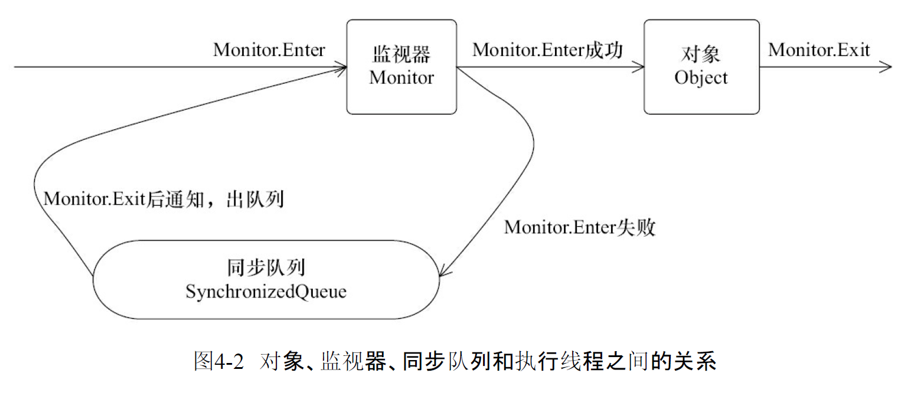
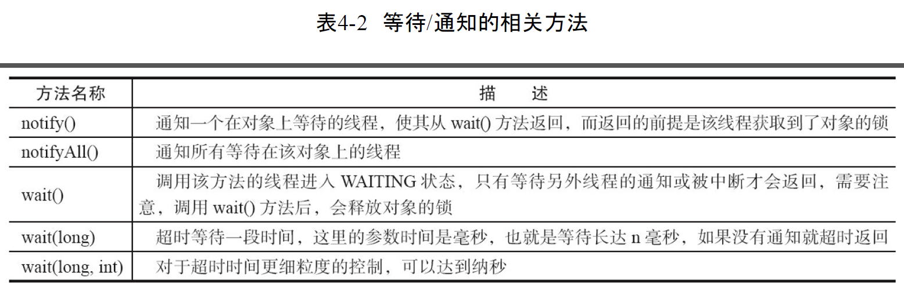

# Java 并发编程基础

## 线程简介

### 什么是线程

## 线程间通信

### volatile和synchronized关键字

volatile可以用来修饰字段(成员变量),就是告知程序任何对该变量的访问均需要从共享内存中获取,而对它的改变必须同步刷新回共享内存,它能保证所有线程对变量访问的可见性

关键字synchronized可以修饰方法或者同步块的形式来进行使用,它主要保证多个线程在同一时刻,只能由一个线程处于方法或同步块中, 它保证了线程对变量访问的可见性和排他性

```class
  Last modified 2018-9-10; size 553 bytes
  MD5 checksum 6859e1bca5b9b2d69fcdafe1d81a730a
  Compiled from "Synchronized.java"
public class com.dhxz.Synchronized
  minor version: 0
  major version: 52
  flags: ACC_PUBLIC, ACC_SUPER
Constant pool:
   #1 = Methodref          #3.#22         // java/lang/Object."<init>":()V
   #2 = Class              #23            // com/dhxz/Synchronized
   #3 = Class              #24            // java/lang/Object
   #4 = Utf8               <init>
   #5 = Utf8               ()V
   #6 = Utf8               Code
   #7 = Utf8               LineNumberTable
   #8 = Utf8               LocalVariableTable
   #9 = Utf8               this
  #10 = Utf8               Lcom/dhxz/Synchronized;
  #11 = Utf8               main
  #12 = Utf8               ([Ljava/lang/String;)V
  #13 = Utf8               args
  #14 = Utf8               [Ljava/lang/String;
  #15 = Utf8               StackMapTable
  #16 = Class              #14            // "[Ljava/lang/String;"
  #17 = Class              #24            // java/lang/Object
  #18 = Class              #25            // java/lang/Throwable
  #19 = Utf8               m
  #20 = Utf8               SourceFile
  #21 = Utf8               Synchronized.java
  #22 = NameAndType        #4:#5          // "<init>":()V
  #23 = Utf8               com/dhxz/Synchronized
  #24 = Utf8               java/lang/Object
  #25 = Utf8               java/lang/Throwable
{
  public com.dhxz.Synchronized();
    descriptor: ()V
    flags: ACC_PUBLIC
    Code:
      stack=1, locals=1, args_size=1
         0: aload_0
         1: invokespecial #1                  // Method java/lang/Object."<init>":()V
         4: return
      LineNumberTable:
        line 3: 0
      LocalVariableTable:
        Start  Length  Slot  Name   Signature
            0       5     0  this   Lcom/dhxz/Synchronized;

  public static void main(java.lang.String[]);
    descriptor: ([Ljava/lang/String;)V
    flags: ACC_PUBLIC, ACC_STATIC
    Code:
      stack=2, locals=3, args_size=1
         0: ldc           #2                  // class com/dhxz/Synchronized
         2: dup
         3: astore_1
         4: monitorenter
         5: aload_1
         6: monitorexit
         7: goto          15
        10: astore_2
        11: aload_1
        12: monitorexit
        13: aload_2
        14: athrow
        15: return
      Exception table:
         from    to  target type
             5     7    10   any
            10    13    10   any
      LineNumberTable:
        line 5: 0
        line 6: 5
        line 7: 15
      LocalVariableTable:
        Start  Length  Slot  Name   Signature
            0      16     0  args   [Ljava/lang/String;
      StackMapTable: number_of_entries = 2
        frame_type = 255 /* full_frame */
          offset_delta = 10
          locals = [ class "[Ljava/lang/String;", class java/lang/Object ]
          stack = [ class java/lang/Throwable ]
        frame_type = 250 /* chop */
          offset_delta = 4

  public static synchronized void m();
    descriptor: ()V
    flags: ACC_PUBLIC, ACC_STATIC, ACC_SYNCHRONIZED
    Code:
      stack=0, locals=0, args_size=0
         0: return
      LineNumberTable:
        line 9: 0
}
SourceFile: "Synchronized.java"

```

上述class对同步代码块使用了monitorenter 和 monitorexit指令, 而同步方法则是依靠方法修饰符上的ACC_SYNCHRONIZED来完成的. 无论哪种方法,其本质是对一个对象的监视器(monitor)进行获取,而这个获取的过程是排他性的,也就是同一时刻只能由一个线程获取到由synchronized所保护对象的监视器.

任意一个对象都有用自己的监视器,当这个对象由同步快或者同步方法调用时,执行方法的线程必须先获取到该对象的监视器才能进入同步快或者同步方法,而没有获取到监视器(执行改方法)的线程将会被阻塞在同步块和同步方法的入口,进入BLOCKED状态



任意线程对Object(Object由synchronized保护)的访问,首先要获取Object的监视器.如果获取失败,线程进入同步队列,线程状态变为BLOCKED.当访问Object的前驱(获得了锁的线程)释放了锁,则该释放操作唤醒阻塞在同步队列中的线程,使其重新尝试对监视器获取

### 等待/通知机制

一个线程修改了对象的值,而另一个线程感知到了变化,然后进行相应的操作,整个过程开始于一个线程,而最终执行又是另一个线程.前者是生产者,后者就是消费者,这种模式隔离了做什么 和怎么做 ,在功能层面上实现了解耦,体系结构上具备良好的伸缩性



等待/通知机制,是指一个线程A调用了对象O的wait()方法进入等待状态,而另一个线程B调用了对象O的notify()方法或notifyAll()方法,线程A收到通知后从对象O的wait()方法返回,进而执行后续操作.上述两个线程通过对象O来完成交互,而对象上的wait()和notify/notifyALl()的关系就如同信号开关一样,用来完成等待和通知方的交互通工作.


### 等待/通知的经典范式

等待方遵循如下原则:

* 获取对象的锁
* 如果条件不满足,那么调用对象的wait()方法,被通知后仍要检查条件
* 条件满足则执行对应逻辑

```
synchronized(对象) {
    while(条件不满足) {
        对象.wait();
    }
    处理对应的逻辑
}
```

通知方遵循如下原则:

* 获取对象的锁
* 改变条件
* 通知所有等待在对象上的线程

```
synchronized(对象) {
    改变条件
    对象.notifyAll();
}
```

### 管道输入/输出流

管道输入/输出流主要包括如下4种具体实现

面向字节

PipedOutputStream

PipedInputStream

面向字符

PipedReader

PipedWriter