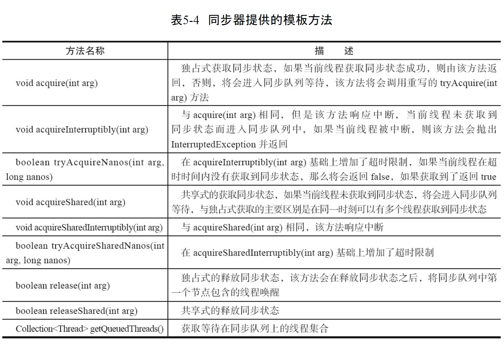
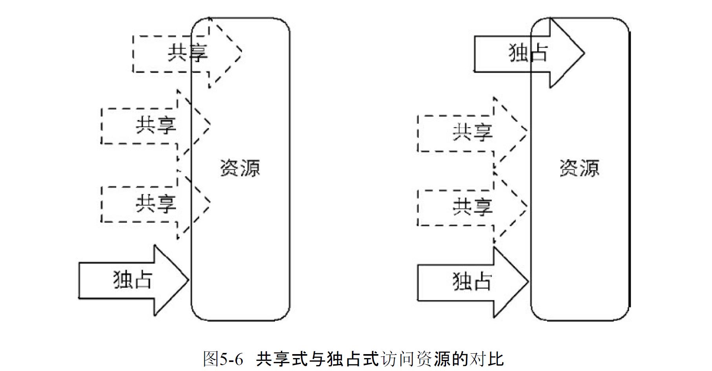
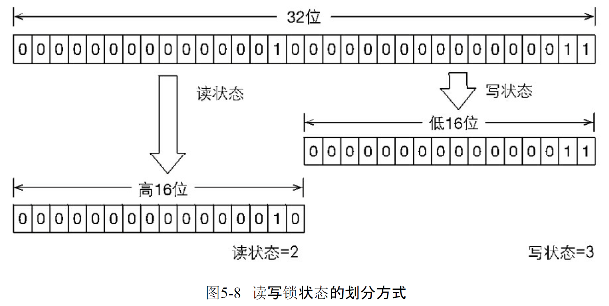

# Java中的锁

## Lock接口


Lock接口的实现基本都是通过聚合一个同步器的子类来完成线程访问的

## 队列同步器

	队列同步器AbstractQueuedSynchronizer,是用来构建锁或者其他同步组件的基础框架,它使用一个int成员变量表示同步状态,通过内置的FIFO队列来完成资源获取线程的排队工作,并法宝的作者(Doug Lea)期望它能够称为实现大部分同步需求的基础
	
	同步器的主要使用方式是继承,子类通过继承同步器并实现它的抽象方法来管理同步状态,在抽象方法的实现过程中不免会对同步状态进行更改,这时就需要使用同步器提供的三个方法(`getState()`,`setState(int newState)`和`compareAndSetState(int expect, int update)`)来进行操作,因为他们能够保证状态改变是安全的.子类推荐被定义为自定义同步组建的静态内部类,同步器自身没有实现任何同步接口,它仅仅是定义了若干同步状态获取和释放的方法来同自定义同步组件使用,同步器既可以支持独占式的获取同步状态,也可以支持共享式的获取同步状态,这样就可以方便实现不同类型的同步组件(ReentrantLock,ReentrantReadWriteLock,CountDownLatch等)
	
	同步器是实现锁(也可以是任意同步组件)的关键,在锁的实现中聚合同步器,利用同步器实现锁的语义. 可以这样理解二者之间的关系: 锁是面向使用者的, 它定义了使用者与锁交互的接口(比如可以允许两个线程并行访问), 隐藏了实现细节; 同步器面向的是锁的实现者, 它简化了锁的实现方式, 屏蔽了同步状态管理,线程排队,等待与唤醒的底层操作. 锁和同步器很好的隔离了使用者和实现者所需要关注的领域

### 队列同步器的接口与示例

同步器的涉及是基于模板方法模式的,也就是说,使用者需要继承同步器并重写指定的方法,随后将同步器组合在自定义同步组件的实现中,并调用同步器提供的模板方法,而这些模板方法将会调用使用者重写的方法.

重写同步器指定的方法时,需要使用同步器提供的如下三个方法来访问或修改同步状态

* `getState()` 获取当前同步状态
* `setState(int newState)` 设置当前同步状态
* `compareAndSetState(int expect,int update)`使用CAS设置当前状态,该方法能够保证状态设置的原子性


实现自定义同步组件时,将会调用同步器提供的模板方法



同步器提供的模板方法基本可分为3类:

* 独占式获取与释放同步状态
* 共享式获取与释放同步状态
* 查询同步队列中等待线程情况

自定义同步组件将使用同步器提供的模板方法来实现自己的同步语义

独占锁:

	同一时刻只能有一个线程获取到锁,而其他获取锁的线程只能处理同步队列中等待,只有获取锁的线程释放了锁,后继的线程才能获取锁

```java
public class Mutex implements Lock {

    /**
     * 静态内部内,自定义同步器
     */
    private static class Sync extends AbstractQueuedSynchronizer {
        /**
         * 是否处于占有状态
         * @return
         */
        @Override
        protected boolean isHeldExclusively() {
            return getState() == 1;
        }

        /**
         * 当状态为0时获取锁
         * @param arg
         * @return
         */
        @Override
        protected boolean tryAcquire(int arg) {
            if (compareAndSetState(0,1)) {
                setExclusiveOwnerThread(Thread.currentThread());
                return true;
            }
            return false;
        }

        /**
         * 释放锁,将状态设置为0
         * @param arg
         * @return
         */
        @Override
        protected boolean tryRelease(int arg) {
            if (getState() == 0) {
                throw new IllegalArgumentException();
            }
            setExclusiveOwnerThread(null);
            setState(0);
            return true;
        }

        /**
         * 返回一个Condition 每个condition都包含了一个condition队列
         * @return
         */
        Condition newCondition(){
            return new ConditionObject();
        }
    }

    /**
     * 将操作代理到Sync上
     */

    private final Sync sync = new Sync();

    @Override
    public void lock() {
        sync.acquire(1);
    }

    @Override
    public void lockInterruptibly() throws InterruptedException {
        sync.acquireInterruptibly(1);
    }

    @Override
    public boolean tryLock() {
        return sync.tryAcquire(1);
    }

    @Override
    public boolean tryLock(long time, TimeUnit unit) throws InterruptedException {
        return sync.tryAcquireNanos(1,unit.toNanos(time));
    }

    @Override
    public void unlock() {
        sync.release(1);
    }

    @Override
    public Condition newCondition() {
        return sync.newCondition();
    }
    public boolean hasQueuedThreads() {
        return sync.hasQueuedThreads();
    }
    public boolean isLocked() {
        return sync.isHeldExclusively();
    }
}
```

上述示例中,独占所Mutex是一个自定义同步组件,它在同一时刻只允许一个线程占有锁. Mutex中定义了一个静态内部类,该内部类继承了同步器并实现了独占式获取和释放同步状态.在`tryAcquire(int acquires)`方法中, 如果经过CAS设置成功(同步状态设置为1),则代表获取了同步状态,而在`tryRelease(int releases)`方法中只是将同步状态重置为0. 用户使用Mutex时并不会直接和内部同步器的实现打交道,而是调用Mutex提供的方法,在Mutex的实现中,以获取锁的`locak()` 方法为例,只需要在实现方法中调用同步器的模板方法`acquire(int args)` 即可,当前线程调用改方法获取同步状态失败后会被加入同步队列中等待,这大大降低了实现一个可靠自定义同步组件的门槛

### 队列同步器的实现分析

```java
/**
     * Wait queue node class.
     *
     * <p>The wait queue is a variant of a "CLH" (Craig, Landin, and
     * Hagersten) lock queue. CLH locks are normally used for
     * spinlocks.  We instead use them for blocking synchronizers, but
     * use the same basic tactic of holding some of the control
     * information about a thread in the predecessor of its node.  A
     * "status" field in each node keeps track of whether a thread
     * should block.  A node is signalled when its predecessor
     * releases.  Each node of the queue otherwise serves as a
     * specific-notification-style monitor holding a single waiting
     * thread. The status field does NOT control whether threads are
     * granted locks etc though.  A thread may try to acquire if it is
     * first in the queue. But being first does not guarantee success;
     * it only gives the right to contend.  So the currently released
     * contender thread may need to rewait.
     *
     * <p>To enqueue into a CLH lock, you atomically splice it in as new
     * tail. To dequeue, you just set the head field.
     * <pre>
     *      +------+  prev +-----+       +-----+
     * head |      | <---- |     | <---- |     |  tail
     *      +------+       +-----+       +-----+
     * </pre>
     *
     * <p>Insertion into a CLH queue requires only a single atomic
     * operation on "tail", so there is a simple atomic point of
     * demarcation from unqueued to queued. Similarly, dequeuing
     * involves only updating the "head". However, it takes a bit
     * more work for nodes to determine who their successors are,
     * in part to deal with possible cancellation due to timeouts
     * and interrupts.
     *
     * <p>The "prev" links (not used in original CLH locks), are mainly
     * needed to handle cancellation. If a node is cancelled, its
     * successor is (normally) relinked to a non-cancelled
     * predecessor. For explanation of similar mechanics in the case
     * of spin locks, see the papers by Scott and Scherer at
     * http://www.cs.rochester.edu/u/scott/synchronization/
     *
     * <p>We also use "next" links to implement blocking mechanics.
     * The thread id for each node is kept in its own node, so a
     * predecessor signals the next node to wake up by traversing
     * next link to determine which thread it is.  Determination of
     * successor must avoid races with newly queued nodes to set
     * the "next" fields of their predecessors.  This is solved
     * when necessary by checking backwards from the atomically
     * updated "tail" when a node's successor appears to be null.
     * (Or, said differently, the next-links are an optimization
     * so that we don't usually need a backward scan.)
     *
     * <p>Cancellation introduces some conservatism to the basic
     * algorithms.  Since we must poll for cancellation of other
     * nodes, we can miss noticing whether a cancelled node is
     * ahead or behind us. This is dealt with by always unparking
     * successors upon cancellation, allowing them to stabilize on
     * a new predecessor, unless we can identify an uncancelled
     * predecessor who will carry this responsibility.
     *
     * <p>CLH queues need a dummy header node to get started. But
     * we don't create them on construction, because it would be wasted
     * effort if there is never contention. Instead, the node
     * is constructed and head and tail pointers are set upon first
     * contention.
     *
     * <p>Threads waiting on Conditions use the same nodes, but
     * use an additional link. Conditions only need to link nodes
     * in simple (non-concurrent) linked queues because they are
     * only accessed when exclusively held.  Upon await, a node is
     * inserted into a condition queue.  Upon signal, the node is
     * transferred to the main queue.  A special value of status
     * field is used to mark which queue a node is on.
     *
     * <p>Thanks go to Dave Dice, Mark Moir, Victor Luchangco, Bill
     * Scherer and Michael Scott, along with members of JSR-166
     * expert group, for helpful ideas, discussions, and critiques
     * on the design of this class.
     */
    static final class Node {
        /** Marker to indicate a node is waiting in shared mode */
        static final Node SHARED = new Node();
        /** Marker to indicate a node is waiting in exclusive mode */
        static final Node EXCLUSIVE = null;

        /** waitStatus value to indicate thread has cancelled */
        static final int CANCELLED =  1;
        /** waitStatus value to indicate successor's thread needs unparking */
        static final int SIGNAL    = -1;
        /** waitStatus value to indicate thread is waiting on condition */
        static final int CONDITION = -2;
        /**
         * waitStatus value to indicate the next acquireShared should
         * unconditionally propagate
         */
        static final int PROPAGATE = -3;

        /**
         * Status field, taking on only the values:
         *   SIGNAL:     The successor of this node is (or will soon be)
         *               blocked (via park), so the current node must
         *               unpark its successor when it releases or
         *               cancels. To avoid races, acquire methods must
         *               first indicate they need a signal,
         *               then retry the atomic acquire, and then,
         *               on failure, block.
         *   CANCELLED:  This node is cancelled due to timeout or interrupt.
         *               Nodes never leave this state. In particular,
         *               a thread with cancelled node never again blocks.
         *   CONDITION:  This node is currently on a condition queue.
         *               It will not be used as a sync queue node
         *               until transferred, at which time the status
         *               will be set to 0. (Use of this value here has
         *               nothing to do with the other uses of the
         *               field, but simplifies mechanics.)
         *   PROPAGATE:  A releaseShared should be propagated to other
         *               nodes. This is set (for head node only) in
         *               doReleaseShared to ensure propagation
         *               continues, even if other operations have
         *               since intervened.
         *   0:          None of the above
         *
         * The values are arranged numerically to simplify use.
         * Non-negative values mean that a node doesn't need to
         * signal. So, most code doesn't need to check for particular
         * values, just for sign.
         *
         * The field is initialized to 0 for normal sync nodes, and
         * CONDITION for condition nodes.  It is modified using CAS
         * (or when possible, unconditional volatile writes).
         */
        volatile int waitStatus;

        /**
         * Link to predecessor node that current node/thread relies on
         * for checking waitStatus. Assigned during enqueuing, and nulled
         * out (for sake of GC) only upon dequeuing.  Also, upon
         * cancellation of a predecessor, we short-circuit while
         * finding a non-cancelled one, which will always exist
         * because the head node is never cancelled: A node becomes
         * head only as a result of successful acquire. A
         * cancelled thread never succeeds in acquiring, and a thread only
         * cancels itself, not any other node.
         */
        volatile Node prev;

        /**
         * Link to the successor node that the current node/thread
         * unparks upon release. Assigned during enqueuing, adjusted
         * when bypassing cancelled predecessors, and nulled out (for
         * sake of GC) when dequeued.  The enq operation does not
         * assign next field of a predecessor until after attachment,
         * so seeing a null next field does not necessarily mean that
         * node is at end of queue. However, if a next field appears
         * to be null, we can scan prev's from the tail to
         * double-check.  The next field of cancelled nodes is set to
         * point to the node itself instead of null, to make life
         * easier for isOnSyncQueue.
         */
        volatile Node next;

        /**
         * The thread that enqueued this node.  Initialized on
         * construction and nulled out after use.
         */
        volatile Thread thread;

        /**
         * Link to next node waiting on condition, or the special
         * value SHARED.  Because condition queues are accessed only
         * when holding in exclusive mode, we just need a simple
         * linked queue to hold nodes while they are waiting on
         * conditions. They are then transferred to the queue to
         * re-acquire. And because conditions can only be exclusive,
         * we save a field by using special value to indicate shared
         * mode.
         */
        Node nextWaiter;

        /**
         * Returns true if node is waiting in shared mode.
         */
        final boolean isShared() {
            return nextWaiter == SHARED;
        }

        /**
         * Returns previous node, or throws NullPointerException if null.
         * Use when predecessor cannot be null.  The null check could
         * be elided, but is present to help the VM.
         *
         * @return the predecessor of this node
         */
        final Node predecessor() throws NullPointerException {
            Node p = prev;
            if (p == null)
                throw new NullPointerException();
            else
                return p;
        }

        Node() {    // Used to establish initial head or SHARED marker
        }

        Node(Thread thread, Node mode) {     // Used by addWaiter
            this.nextWaiter = mode;
            this.thread = thread;
        }

        Node(Thread thread, int waitStatus) { // Used by Condition
            this.waitStatus = waitStatus;
            this.thread = thread;
        }
    }
```


1. 同步队列

   同步队列依赖内部的同步队列(一个FIFO双向队列)来完成同步状态的管理,当前线程获取东部状态失败时,同步器会将当前线程以及等待状态等信息狗造成一个节点(Node)并将其加入同步队列,同时会阻塞当前线程,当同步状态释放时,会把首节点中的线程唤醒使其再次尝试获取同步状态
   同步队列中的节点(Node)用来保存获取同步状态失败的线程引用,等待状态以及前驱和后继节点,节点属性类型与名称描述如下:
   
   节点是构成同步队列的基础,同步器拥有首节点(head)和尾节点(tail),没有成功获取同步状态的线程将会成为节点加入该队列的尾部,同步队列的基本结构如下
   
   同步器包含两个几点类型的引用,一个指向头节点,一个指向尾节点,当一个线程成功获取了同步状态(或者锁),其他线程将无法获取到同步状态,转而被构造成节点并加入到同步队列中,而这个加入队列的过程必须保证线程安全,因此同步器提供了基于CAS的设置尾节点的方法:`compareAndSetTail(Node expect,Node update)`,它需要传递当前线程'认为'的尾节点和当前节点,只有设置成功后当前节点才正式与之前的尾节点建立联系

   同步器将节点加入到同步队列的过程如下:

   

   同步队列遵循FIFO,首节点是获取同步状态成功的节点,首节点的线程在释放同步状态时,会唤醒后继节点,而后继节点将会在获取同步状态成功时将字节设置为首节点,该过程如下:

   

   设置后首节点时通过获取同步状态成功的线程来完成的,由于只有一个线程能够获取到同步状态,因此设置头节点的方法并不需要使用CAS来保证,它只需要将首节点设置为原首节点的后继节点并断开原首节点的next引用即可.

2. 独占式同步状态获取与释放

   通过调用同步器的acquire(int arg)方法可以获取同步状态,该方法对于终端不敏感,也就是由于线程获取同步状态失败后进入同步队列,后继对线程进行中断操作时,线程不会从同步队列中移出

```java
/**
     * Acquires in exclusive mode, ignoring interrupts.  Implemented
     * by invoking at least once {@link #tryAcquire},
     * returning on success.  Otherwise the thread is queued, possibly
     * repeatedly blocking and unblocking, invoking {@link
     * #tryAcquire} until success.  This method can be used
     * to implement method {@link Lock#lock}.
     *
     * @param arg the acquire argument.  This value is conveyed to
     *        {@link #tryAcquire} but is otherwise uninterpreted and
     *        can represent anything you like.
     */
    public final void acquire(int arg) {
        if (!tryAcquire(arg) &&
            acquireQueued(addWaiter(Node.EXCLUSIVE), arg))
            selfInterrupt();
    }
```

```java
    /**
     * Creates and enqueues node for current thread and given mode.
     *
     * @param mode Node.EXCLUSIVE for exclusive, Node.SHARED for shared
     * @return the new node
     */
    private Node addWaiter(Node mode) {
        // 构造节点
        Node node = new Node(Thread.currentThread(), mode);
        // 快速尝试,直接添加到队尾CAS
        // Try the fast path of enq; backup to full enq on failure
        Node pred = tail;
        if (pred != null) {
            node.prev = pred;
            if (compareAndSetTail(pred, node)) {
                pred.next = node;
                return node;
            }
        }
        enq(node);
        return node;
    }
    /**
     *  将节点添加到队列,如果必要初始化,
     * Inserts node into queue, initializing if necessary. See picture above.
     * @param node the node to insert
     * @return node's predecessor
     */
    /**
     * Tail of the wait queue, lazily initialized.  Modified only via
     * method enq to add new wait node.
     */
    private transient volatile Node tail;

    private Node enq(final Node node) {
        for (;;) {
            // 获取队尾节点,如果没有 初始化
            Node t = tail;
            if (t == null) { // Must initialize
                if (compareAndSetHead(new Node()))
                    tail = head;
            } else {
                // 如果存在队尾节点,将尾节点赋值给当前节点的前驱,CASupdate尾节点,将当前节点赋值为尾节点的后继 返回
                node.prev = t;
                if (compareAndSetTail(t, node)) {
                    t.next = node;
                    return t;
                }
            }
        }
    }
    /**
     * CAS head field. Used only by enq.
     */
    private final boolean compareAndSetHead(Node update) {
        return unsafe.compareAndSwapObject(this, headOffset, null, update);
    }
    /**
     * CAS tail field. Used only by enq.
     */
    private final boolean compareAndSetTail(Node expect, Node update) {
        return unsafe.compareAndSwapObject(this, tailOffset, expect, update);
    }
```

```java
    /**
     * Acquires in exclusive uninterruptible mode for thread already in
     * queue. Used by condition wait methods as well as acquire.
     *
     * @param node the node
     * @param arg the acquire argument
     * @return {@code true} if interrupted while waiting
     */
    final boolean acquireQueued(final Node node, int arg) {
        // 初始化失败flag
        boolean failed = true;
        try {
            // 是否中断flag
            boolean interrupted = false;
            for (;;) {
                // 获取当前节点的前驱
                final Node p = node.predecessor();
                // 判断这个前驱是否是头节点, 如果是 尝试获取锁
                if (p == head && tryAcquire(arg)) {
                    //获取成功 将当前节点设置为头节点,失败flag变为false
                    setHead(node);
                    p.next = null; // help GC
                    failed = false;
                    return interrupted;
                }
                if (shouldParkAfterFailedAcquire(p, node) &&
                    parkAndCheckInterrupt())
                    interrupted = true;
            }
        } finally {
            // 最后判断是否失败  如果失败 取消当前节点
            if (failed)
                cancelAcquire(node);
        }
    }

/**
     * Checks and updates status for a node that failed to acquire.
     * Returns true if thread should block. This is the main signal
     * control in all acquire loops.  Requires that pred == node.prev.
     *
     * @param pred node's predecessor holding status
     * @param node the node
     * @return {@code true} if thread should block
     */
    private static boolean shouldParkAfterFailedAcquire(Node pred, Node node) {
        int ws = pred.waitStatus;
        if (ws == Node.SIGNAL)
            /*
             * This node has already set status asking a release
             * to signal it, so it can safely park.
             */
            return true;
        if (ws > 0) {
            /*
             * Predecessor was cancelled. Skip over predecessors and
             * indicate retry.
             */
            do {
                node.prev = pred = pred.prev;
            } while (pred.waitStatus > 0);
            pred.next = node;
        } else {
            /*
             * waitStatus must be 0 or PROPAGATE.  Indicate that we
             * need a signal, but don't park yet.  Caller will need to
             * retry to make sure it cannot acquire before parking.
             */
            compareAndSetWaitStatus(pred, ws, Node.SIGNAL);
        }
        return false;
    }

/**
     * Cancels an ongoing attempt to acquire.
     *
     * @param node the node
     */
    private void cancelAcquire(Node node) {
        // Ignore if node doesn't exist
        if (node == null)
            return;

        node.thread = null;

        // Skip cancelled predecessors
        Node pred = node.prev;
        while (pred.waitStatus > 0)
            node.prev = pred = pred.prev;

        // predNext is the apparent node to unsplice. CASes below will
        // fail if not, in which case, we lost race vs another cancel
        // or signal, so no further action is necessary.
        Node predNext = pred.next;

        // Can use unconditional write instead of CAS here.
        // After this atomic step, other Nodes can skip past us.
        // Before, we are free of interference from other threads.
        node.waitStatus = Node.CANCELLED;

        // If we are the tail, remove ourselves.
        if (node == tail && compareAndSetTail(node, pred)) {
            compareAndSetNext(pred, predNext, null);
        } else {
            // If successor needs signal, try to set pred's next-link
            // so it will get one. Otherwise wake it up to propagate.
            int ws;
            if (pred != head &&
                ((ws = pred.waitStatus) == Node.SIGNAL ||
                 (ws <= 0 && compareAndSetWaitStatus(pred, ws, Node.SIGNAL))) &&
                pred.thread != null) {
                Node next = node.next;
                if (next != null && next.waitStatus <= 0)
                    compareAndSetNext(pred, predNext, next);
            } else {
                unparkSuccessor(node);
            }

            node.next = node; // help GC
        }
    }
```

上述代码主要完成了同步状态获取,节点构造,加入同步状态以及在同步队列中字段等待的相关工作,其主要逻辑时:首先调用自定义同步器实现的`tryAcquire(int arg)`方法,该方法保证线程安全的获取同步状态,如果同步状态获取失败,则构造同步节点(独占式Node.EXCLUSIVE,同一时刻只能由一个线程成功获取同步状态)并通过`addWaiter(Node node)`方法将该节点加入到同步队列的尾部,最后调用`acquireQueued(Node node,int arg)`方法,是的该节点以'死循环'的方式获取同步状态.如果获取不到则阻塞节点中的线程,而被阻塞线程的唤醒主要依靠前驱节点的出队或阻塞线程被中断来实现

通过`compareAndSetTail(Node expect,Node update)`方法来确保节点能够被线程安全的添加. 如果使用一个普通的LinkedList来维护节点之间的关系,那么当一个线程获取了同步状态,而其他多个线程由于调用`trtAcquire(int arg)`方法获取同步状态失败而并发的被添加到LinkedList时,LinkedList将难以保证Node的正确添加,最终的结果可能是节点的数量有偏差,而且顺序也是混乱的

在`enq(findl Node node)`方法中,同步器通过'死循环'来保证节点的正确添加,在'死循环'中只有通过CAS将节点设置成为尾节点之后,当前线程才能从该方法返回,否则,当前线程不断地尝试设置. 可以看出 `enq(final Node node)`方法将并发添加节点的请求通过CAS串行化

节点进入同步队列之后,就进入了一个自旋的过程,每个节点(或者说每个线程)都在自省地观察,当条件满足,获取到了同步状态,就可以从这个自旋过程中退出,否则依旧留在这个自旋过程中(并会阻塞节点的线程)

在`acquireQueued(final Node node, int age)` 方法中,当前线程在'死循环'中尝试获取同步状态,而只有前驱节点是头节点才能尝试获取同步状态 这是为什么?原因如下

* 头节点是成功获取到同步状态的节点,而头节点的线程释放了同步状态后,将会唤醒其后继节点,后继节点的线程被唤醒后需要检查自己的前驱节点是否是头节点
* 维护同步队列的FIFO原则.该方法中,节点自旋获取同步状态的行为如下: 由于非首节点线程的前驱节点出队或者被中断从而等待状态返回,对吼检查自己的前驱是否是头节点,如果是,则尝试获取同步状态. 可以看到节点和节点之间在循环检查的过程中基本不互相通信,而是简单地判断自己的前驱是否为头节点,这样就使得节点的释放规则符合FIFO,并且也便于对过早通知的处理(过早通知是指前驱节点不是头节点的线程由于中断而被唤醒)

独占式同步状态获取流程如下:

前驱节点为头节点且能够获取同步状态的判断条件和线程进入等待状态时获取同步状态的自旋过程.当同步状态获取成功之后,当前线程从`acquire(int arg)`方法返回,如果对于锁这种并发组件而言,代表当前线程获取了锁

当前线程获取同步状态并执行了相应逻辑之后,就需要释放同步状态,使得后继节点能够继续获取同步状态.通过调用同步器的`release(int arg)`方法可以释放同步状态,改方法在释放了同步状态之后,会唤醒其后继节点(进而使后继节点重新尝试获取同步状态)

```java
    /**
     * Releases in exclusive mode.  Implemented by unblocking one or
     * more threads if {@link #tryRelease} returns true.
     * This method can be used to implement method {@link Lock#unlock}.
     *
     * @param arg the release argument.  This value is conveyed to
     *        {@link #tryRelease} but is otherwise uninterpreted and
     *        can represent anything you like.
     * @return the value returned from {@link #tryRelease}
     */
    public final boolean release(int arg) {
        if (tryRelease(arg)) {
            Node h = head;
            if (h != null && h.waitStatus != 0)
                unparkSuccessor(h);
            return true;
        }
        return false;
    }

```

该方法执行时,会唤醒头节点的后继节点线程,`unparkSuccessor(Node node)`方法使用`LockSupport`来唤醒处于等待状态的线程

总结:

> 在获取同步状态时,同步器维护一个同步队列,获取状态失败的线程都会被加入到队列中并进行自旋;移出队列(或停止自旋)的条件是前驱节点为头节点并获取到同步状态.在释放同步状态时,同步器调用`tryRelease(int arg)` 方法释放同步状态,然后唤醒头节点的后继节点

3. 共享式同步状态获取与释放

共享式获取与独占式获取主要的区别在于同一时刻能否有多个线程同时获取到同步状态. 以未见的读写为例,如果一个程序在对文件进行读操作,那么这一时刻对于文件的写操作均被阻塞,而读操作能够同时进行.写操作要求对资源的独占式访问,而读操作可以是共享式访问,两种不同的访问模式在同一时刻对文件或资源的访问情况如下:

共享式访问资源时,其他共享式的访问均被允许,而独占式访问被阻塞,右半部分是独占式访问资源时,同一时刻其他访问均被阻塞

通过调用同步器的`acquireShared(int arg)`方法可以共享式地获取同步状态 代码如下:

```java
    /**
     * Acquires in shared mode, ignoring interrupts.  Implemented by
     * first invoking at least once {@link #tryAcquireShared},
     * returning on success.  Otherwise the thread is queued, possibly
     * repeatedly blocking and unblocking, invoking {@link
     * #tryAcquireShared} until success.
     *
     * @param arg the acquire argument.  This value is conveyed to
     *        {@link #tryAcquireShared} but is otherwise uninterpreted
     *        and can represent anything you like.
     */
    public final void acquireShared(int arg) {
        if (tryAcquireShared(arg) < 0)
            doAcquireShared(arg);
    }
```

```java
    /**
     * Acquires in shared uninterruptible mode.
     * @param arg the acquire argument
     */
    private void doAcquireShared(int arg) {
        final Node node = addWaiter(Node.SHARED);
        boolean failed = true;
        try {
            boolean interrupted = false;
            for (;;) {
                final Node p = node.predecessor();
                if (p == head) {
                    int r = tryAcquireShared(arg);
                    if (r >= 0) {
                        setHeadAndPropagate(node, r);
                        p.next = null; // help GC
                        if (interrupted)
                            selfInterrupt();
                        failed = false;
                        return;
                    }
                }
                if (shouldParkAfterFailedAcquire(p, node) &&
                    parkAndCheckInterrupt())
                    interrupted = true;
            }
        } finally {
            if (failed)
                cancelAcquire(node);
        }
    }
```

在`acquireShared(int arg)`方法中,同步器调用`tryAcquireShared(int arg)`方法尝试获取同步状态,`tryAcquireShared(int arg)`方法返回值为int类型,当返回值大于等于0时,表示能够获取到同步状态. 因此,在共享式获取自旋锁地过程中,成功获取到同步状态并退出自旋地条件是`tryAcquireShared(int arg)`方法返回值大于等于0. 可以看到,在`doAcquireShared(int arg)`方法地自旋过程中,如果当前节点地前驱为头节点时,尝试获取同步状态,如果返回值大于等于0,表示该次获取同步状态成功并从自旋过程中退出

与独占式一样,共享式获取也需要释放同步状态:

```java
    /**
     * Releases in shared mode.  Implemented by unblocking one or more
     * threads if {@link #tryReleaseShared} returns true.
     *
     * @param arg the release argument.  This value is conveyed to
     *        {@link #tryReleaseShared} but is otherwise uninterpreted
     *        and can represent anything you like.
     * @return the value returned from {@link #tryReleaseShared}
     */
    public final boolean releaseShared(int arg) {
        if (tryReleaseShared(arg)) {
            doReleaseShared();
            return true;
        }
        return false;
    }
```

```java
    /**
     * Release action for shared mode -- signals successor and ensures
     * propagation. (Note: For exclusive mode, release just amounts
     * to calling unparkSuccessor of head if it needs signal.)
     */
    private void doReleaseShared() {
        /*
         * Ensure that a release propagates, even if there are other
         * in-progress acquires/releases.  This proceeds in the usual
         * way of trying to unparkSuccessor of head if it needs
         * signal. But if it does not, status is set to PROPAGATE to
         * ensure that upon release, propagation continues.
         * Additionally, we must loop in case a new node is added
         * while we are doing this. Also, unlike other uses of
         * unparkSuccessor, we need to know if CAS to reset status
         * fails, if so rechecking.
         */
        for (;;) {
            Node h = head;
            if (h != null && h != tail) {
                int ws = h.waitStatus;
                if (ws == Node.SIGNAL) {
                    if (!compareAndSetWaitStatus(h, Node.SIGNAL, 0))
                        continue;            // loop to recheck cases
                    unparkSuccessor(h);
                }
                else if (ws == 0 &&
                         !compareAndSetWaitStatus(h, 0, Node.PROPAGATE))
                    continue;                // loop on failed CAS
            }
            if (h == head)                   // loop if head changed
                break;
        }
    }
```

该方法释放同步状态后,会唤醒后续处于等待状态地节点.对于能够支持多个线程同时访问地并发组件(比如Semaphore),它和独占式主要地区别在于`tryReleaseShared(int arg)`方法必须确保同步状态(或者资源数)线程安全释放,一般是通过循环和CAS来保证地,因为释放同步状态地操作会同时来自多个线程.

4. 独占式超时获取同步状态

通过调用同步器的`doAcquireNanos(int arg,long nanosTimeout)`方法可以超时获取同步状态,即在指定的时间段内获取到同步状态,如果获取到同步状态则返回true,否则返回false.该方法提供了传统Java同步操作(比如synchronized)所不具备的特性

响应中断的同步状态获取过程:

在Java5之前,当一个线程获不到锁而被阻塞在synchronized之外时,对该线程进行中断操作,此时该线程的中断标志位会被修改,但线程依旧会被阻塞在synchronized上,等待获取锁.在Java5中,同步器提供了`acquireInterruptibly(int arg)`方法,这个方法在等待获取同步状态时,如果当前线程被中断,会立即返回,并抛出`InterruptedException`

超时获取同步状态过程可以被视作响应中断获取同步状态过程的'增强版',`doAcquireNanos(int arg,long nanosTimeout)`方法在支持响应中断的基础上,增加了超时获取的特性.正对超市获取,主要需要计算出需要休眠的时间间隔`nanosTimeout`,为了防止过早通知`nanosTimeout` 计算公式为:`nanosTimeout -= now - lastTime`其中 `now` 为当前唤醒时间`lastTIme` 为上次唤醒时间, 如果`nanosTimeout` 大于0 则表示超时时间味道,需要继续休眠`nanosTimeout` 纳秒,反之表示已经超时.

```java
    /**
     * Acquires in exclusive timed mode.
     *
     * @param arg the acquire argument
     * @param nanosTimeout max wait time
     * @return {@code true} if acquired
     */
    private boolean doAcquireNanos(int arg, long nanosTimeout)
            throws InterruptedException {
        if (nanosTimeout <= 0L)
            return false;
        final long deadline = System.nanoTime() + nanosTimeout;
        final Node node = addWaiter(Node.EXCLUSIVE);
        boolean failed = true;
        try {
            for (;;) {
                final Node p = node.predecessor();
                if (p == head && tryAcquire(arg)) {
                    setHead(node);
                    p.next = null; // help GC
                    failed = false;
                    return true;
                }
                nanosTimeout = deadline - System.nanoTime();
                if (nanosTimeout <= 0L)
                    return false;
                if (shouldParkAfterFailedAcquire(p, node) &&
                    nanosTimeout > spinForTimeoutThreshold)
                    LockSupport.parkNanos(this, nanosTimeout);
                if (Thread.interrupted())
                    throw new InterruptedException();
            }
        } finally {
            if (failed)
                cancelAcquire(node);
        }
    }
```

该方法在自旋过程中,当节点的前驱节点为头节点时尝试获取同步状态,如果获取成功则从改方法返回,这个过程和同步获取类型,但在同步状态获取失败的处理上有所不同.如果当前线程获取同步状态失败,则判断是否超时(nanosTimeout小于0表示已经超时),如果没有超时,重新计算超时间隔,然后使当前线程等待nanosTimeout纳秒(当已到设置的超时时间,该线程会从`LockSupport.parkNanos(Object blocker,long nanos)` 方法返回)

如果nanosTimeout小于等于`spinForTimeoutThreshold(1000纳秒)`时,将不会使该线程进入超时等待,而是进入快速的自旋过程.原因在于,非常短的超时等待无法做到十分精确,如果这时在进入超时等待,相反会让nanosTimeout的超时时间整体上表现得不精确.因此,在超时时间非常短的情况下,同步器会进入无条件的快速自旋

独占式超时获取同步状态流程如图

独占式超时获取同步状态`doAcquireNanos(int arg, long nanosTimeout`和独占式获取同步状态`acquire(int arg)`在流程上非常相似,主要区别在于未获取到同步状态时的逻辑.`acquire(int arg)`在未获取到同步状态时,将会使当前线程一致处于等待状态,而`doAcquireNanos(int arg,long nanosTimeout)`会使当前线程等待nanosTimeout纳秒,如果当前线程在nanosTimeout纳秒内没有获取到同步状态,将会从等待逻辑中自动返回.

5. 自定义同步组件 --- TwinsLock

## 重入锁

重入锁ReentrantLock 是指支持重进入的锁,它表示该锁能够支持一线程对资源的重复加锁.除此之外,该锁还支持获取锁时的公平和非公平选择

synchronized关键字隐式的支持重进入,比如一个synchronized修饰的递归方法,在方法执行时,执行线程在获取了锁之后仍能连续很多次的获取该锁,而不会阻塞自己

1. 实现重进入
  重进入是指任意线程在获取到锁之后能够再次获取该锁而不会被锁阻塞,该特性的实现需要解决以下两个问题
  1.1. 线程再次获取锁. 锁需要去识别获取锁的线程是否未当前占据锁的线程,如果是,则再次获取成功
  1.2. 锁的最终释放. 线程重复n次获取了锁,随后在第n次释放了该锁后,其他线程能够获取到该锁.锁的最终释放要求锁对于获取进行自增计数,计数表示当前锁被重复获取的次数,而锁被释放时,计数自减,当计数等于0时表示锁已经成功释放

ReentrantLock是通过组合自定义同步器来实现锁的获取与释放

```java
        final boolean nonfairTryAcquire(int acquires) {
            final Thread current = Thread.currentThread();
            int c = getState();
            if (c == 0) {
                if (compareAndSetState(0, acquires)) {
                    setExclusiveOwnerThread(current);
                    return true;
                }
            }
            // 判断当前线程是否是获取锁的线程 如果是  获取同步状态成功, 计数自增
            else if (current == getExclusiveOwnerThread()) {
                int nextc = c + acquires;
                if (nextc < 0) // overflow
                    throw new Error("Maximum lock count exceeded");
                setState(nextc);
                return true;
            }
            return false;
        }
```

该方法增加了再次获取锁同步状态的处理逻辑:通过判断当前线程是否未获取锁的线程来界定操作是否成功,如果是获取锁的线程再次请求,则将同步状态值进行增加并返回true,表示获取同步状态成功

释放锁也需要同步自减

```java
protected final boolean tryRelease(int releases) {
            int c = getState() - releases;
            if (Thread.currentThread() != getExclusiveOwnerThread())
                throw new IllegalMonitorStateException();
            boolean free = false;
            if (c == 0) {
                free = true;
                setExclusiveOwnerThread(null);
            }
            setState(c);
            return free;
        }

```

如果该锁获取了n次,那么前(n-1)次`tryRelease(int release)`方法必须返回false,而只有同步状态完全释放了,才能返回true.可以看到,改方法将同步状态是否为0作为最终释放的条件,当同步状态为0时,将占有线程设置为null,并返回true,表示释放成功.

2. 公平与非公平获取锁的区别

公平性与否是针对获取锁而言的,如果一个锁是公平的,那么锁的获取顺序就应该符合请求的绝对时间顺序,也就是FIFO

对于非公平锁`nonfairTryAcquire(int acquires)`只要CAS设置同步状态成功,则表示当前线程获取了锁而公平锁不同

```java
       /**
         * Fair version of tryAcquire.  Don't grant access unless
         * recursive call or no waiters or is first.
         */
        protected final boolean tryAcquire(int acquires) {
            final Thread current = Thread.currentThread();
            int c = getState();
            if (c == 0) {
                // 如果该节点有前驱,说明有线程比当前线程更早地请求获取锁,因此需要等待前驱线程获取并释放锁后参能继续获取锁
                if (!hasQueuedPredecessors() &&
                    compareAndSetState(0, acquires)) {
                    setExclusiveOwnerThread(current);
                    return true;
                }
            }
            else if (current == getExclusiveOwnerThread()) {
                int nextc = c + acquires;
                if (nextc < 0)
                    throw new Error("Maximum lock count exceeded");
                setState(nextc);
                return true;
            }
            return false;
        }
    }
```

```java
    /**
     * 该方法判断同步队列中当前节点是否有前驱节点
     * Queries whether any threads have been waiting to acquire longer
     * than the current thread.
     *
     * <p>An invocation of this method is equivalent to (but may be
     * more efficient than):
     *  <pre> {@code
     * getFirstQueuedThread() != Thread.currentThread() &&
     * hasQueuedThreads()}</pre>
     *
     * <p>Note that because cancellations due to interrupts and
     * timeouts may occur at any time, a {@code true} return does not
     * guarantee that some other thread will acquire before the current
     * thread.  Likewise, it is possible for another thread to win a
     * race to enqueue after this method has returned {@code false},
     * due to the queue being empty.
     *
     * <p>This method is designed to be used by a fair synchronizer to
     * avoid <a href="AbstractQueuedSynchronizer#barging">barging</a>.
     * Such a synchronizer's {@link #tryAcquire} method should return
     * {@code false}, and its {@link #tryAcquireShared} method should
     * return a negative value, if this method returns {@code true}
     * (unless this is a reentrant acquire).  For example, the {@code
     * tryAcquire} method for a fair, reentrant, exclusive mode
     * synchronizer might look like this:
     *
     *  <pre> {@code
     * protected boolean tryAcquire(int arg) {
     *   if (isHeldExclusively()) {
     *     // A reentrant acquire; increment hold count
     *     return true;
     *   } else if (hasQueuedPredecessors()) {
     *     return false;
     *   } else {
     *     // try to acquire normally
     *   }
     * }}</pre>
     *
     * @return {@code true} if there is a queued thread preceding the
     *         current thread, and {@code false} if the current thread
     *         is at the head of the queue or the queue is empty
     * @since 1.7
     */
    public final boolean hasQueuedPredecessors() {
        // The correctness of this depends on head being initialized
        // before tail and on head.next being accurate if the current
        // thread is first in queue.
        Node t = tail; // Read fields in reverse initialization order
        Node h = head;
        Node s;
        return h != t &&
            ((s = h.next) == null || s.thread != Thread.currentThread());
    }
```

为什么会出现线程连续取锁地情况?

当一个线程请求锁时,只要获取了同步状态即成功获取了锁,在这个前提下,刚释放锁地线程再次获取同步状态地几率会非常大,使得其他线程只能在同步队列中等待.

非公平锁可能使线程'饥饿',为什么它会被设定成默认地实现?

公平锁保证锁地获取按照FIFO原则,代价是进行了大量地线程切换,非公平锁虽然可能造成线程'饥饿',但极少地线程切换保证了更大地吞吐量.

## 读写锁

排他锁:同一时刻只允许一个线程进行访问

读写锁:读锁在同一时刻可以允许多个线程访问,但是在写线程访问时,所有的读线程与其他线程均被阻塞.读写锁维护了以对锁,一个读锁和一个写锁,通过读写分离使得并发性相比一般的排他锁有了很大的提升

除了保证写操作对读操作的可见性以及并发性的提升之外,读写锁能够简化读写交互场景的编程方式.

一般情况下,读写锁的性能都会比排他锁好,应为大多数场景读是多于写的. 在读多于写的情况下,读写锁能够提供比排他锁更好的并发性和吞吐量.Java并法宝提供读写锁的实现是ReentrantReadWriteLock 特性如下:


### 读写锁的接口与示例

ReadWriteLock 仅定义了获取读锁和写锁的两个方法,即`readLock()`和`writeLock()`方法,而其实现---ReentrantReadWriteLock,除了接口方法之外,还提供了一些便于外界监控内部工作状态的方法如下:


```java
/**
 * 一个简单的ReadWriteLock实现的对象缓存
 */
public class Cache {
    static Map<String,Object> map = new HashMap<>();
    static ReentrantReadWriteLock rwl = new ReentrantReadWriteLock();
    static Lock r = rwl.readLock();
    static Lock w = rwl.writeLock();

    /**
     * 读锁
     * @param key
     * @return
     */
    public static final Object get(String key) {
        r.lock();
        try {
            return map.get(key);
        }finally {
            r.unlock();
        }
    }

    /**
     * 写锁
     * @param key
     * @param value
     * @return
     */
    public static final Object put(String key,Object value) {
        w.lock();
        try {
            return map.put(key,value);
        }finally {
            w.unlock();
        }
    }

    /**
     * 写锁
     */
    public static final void clear() {
        w.lock();
        try {
            map.clear();
        }finally {
            w.unlock();
        }
    }
}
```

### 读写锁的实现分析

1. 读写状态的设计

读写锁同样依赖自定义同步器来实现同步功能,而读写状态就是其同步器的同步状态.在ReentrantLock中自定义同步器的实现,同步状态表示锁被一个线程重复获取的次数,而读写锁的自定义同步器需要在同步状态(一个整型变量)上维护多个读线程和一个写线程的状态,使得该状态的设计成为读写锁的实现关键

如果在一个整型变量上维护多种状态,就一定需要'按位切割使用'这个变量,读写锁将变量分为两个部分,高16位表示读,低16位表示写划分如下:

根据状态的划分能得出一个推论:S不等于0时当写状态(S&0x0000FFFF)等于0时,则度状态(S>>>16)大于0,即读锁已经被获取.

2. 写锁的获取与释放

写锁时一个支持重进入的排他锁,如果当前线程已经获取了写锁,则增加写状态.如果当前线程在获取写锁时,读锁已经被获取(读状态不为0)或该线程不是已经获取写锁的线程,则当前线程进入等待状态

```java

        protected final boolean tryAcquire(int acquires) {
            /*
             * Walkthrough:
             * 1. If read count nonzero or write count nonzero
             *    and owner is a different thread, fail.
             * 2. If count would saturate, fail. (This can only
             *    happen if count is already nonzero.)
             * 3. Otherwise, this thread is eligible for lock if
             *    it is either a reentrant acquire or
             *    queue policy allows it. If so, update state
             *    and set owner.
             */
            Thread current = Thread.currentThread();
            int c = getState();
            int w = exclusiveCount(c);
            //当前状态不为0
            if (c != 0) {
                //存在读锁或者当前获取线程不是已经获取写锁的线程
                // (Note: if c != 0 and w == 0 then shared count != 0)
                if (w == 0 || current != getExclusiveOwnerThread())
                    return false;
                if (w + exclusiveCount(acquires) > MAX_COUNT)
                    throw new Error("Maximum lock count exceeded");
                // Reentrant acquire
                setState(c + acquires);
                return true;
            }
            if (writerShouldBlock() ||
                !compareAndSetState(c, c + acquires))
                return false;
            setExclusiveOwnerThread(current);
            return true;
        }

```

该方法除了重入条件(当前线程为获取了写锁的线程)之外,增加了一个读锁是否存在的判断. 如果读锁存在,则写锁不能被获取,原因在于:读写锁要确保写锁的操作对读锁可见,如果允许读锁在已被获取的情况下对写锁操作,那么在运行的其他读线程就无法感知到当前写线程的操作. 因此,只有等待其他读线程都释放了读锁,写锁才能被当前线程获取,而写锁一旦被获取,则其他读写线程的后续访问均被阻塞

写锁的释放与ReentrantLock的释放过程基本类似,每次释放均减少写状态,当写状态为0时表示写锁已被成功释放,从而等待的读写线程能够继续访问读写锁,同时前次写县城的修改对后续读写线程可见.

3. 读锁的获取与释放

读锁是一个支持重进入的共享锁,他能够被多个线程同时获取,在没有其他写线程访问(或者写状态为0)时,读锁总会被成功的获取,而所做的也只是(线程安全的)增加读状态. 如果当前线程已经获取了读锁,则增加读状态. 如果当前线程在获取读锁时, 写锁已经被其他线程获取了, 则进入等待状态. 获取读锁的实现从Java5到Java6变复杂了许多,主要时新增了一些功能,如`getReadHoldCount()`方法,返回当前线程获取读锁的次数.读状态时所有线程获取读锁次数的总和,而每个线程各自获取读锁的次数只能选择保存在ThreadLocal中,有线程自身维护

```java
       protected final int tryAcquireShared(int unused) {
            /*
             * Walkthrough:
             * 1. If write lock held by another thread, fail.
             * 2. Otherwise, this thread is eligible for
             *    lock wrt state, so ask if it should block
             *    because of queue policy. If not, try
             *    to grant by CASing state and updating count.
             *    Note that step does not check for reentrant
             *    acquires, which is postponed to full version
             *    to avoid having to check hold count in
             *    the more typical non-reentrant case.
             * 3. If step 2 fails either because thread
             *    apparently not eligible or CAS fails or count
             *    saturated, chain to version with full retry loop.
             */
            Thread current = Thread.currentThread();
            int c = getState();
            if (exclusiveCount(c) != 0 &&
                getExclusiveOwnerThread() != current)
                return -1;
            int r = sharedCount(c);
            if (!readerShouldBlock() &&
                r < MAX_COUNT &&
                compareAndSetState(c, c + SHARED_UNIT)) {
                if (r == 0) {
                    firstReader = current;
                    firstReaderHoldCount = 1;
                } else if (firstReader == current) {
                    firstReaderHoldCount++;
                } else {
                    HoldCounter rh = cachedHoldCounter;
                    if (rh == null || rh.tid != getThreadId(current))
                        cachedHoldCounter = rh = readHolds.get();
                    else if (rh.count == 0)
                        readHolds.set(rh);
                    rh.count++;
                }
                return 1;
            }
            return fullTryAcquireShared(current);
        }
```

```java
/**
         * Full version of acquire for reads, that handles CAS misses
         * and reentrant reads not dealt with in tryAcquireShared.
         */
        final int fullTryAcquireShared(Thread current) {
            /*
             * This code is in part redundant with that in
             * tryAcquireShared but is simpler overall by not
             * complicating tryAcquireShared with interactions between
             * retries and lazily reading hold counts.
             */
            HoldCounter rh = null;
            for (;;) {
                int c = getState();
                if (exclusiveCount(c) != 0) {
                    if (getExclusiveOwnerThread() != current)
                        return -1;
                    // else we hold the exclusive lock; blocking here
                    // would cause deadlock.
                } else if (readerShouldBlock()) {
                    // Make sure we're not acquiring read lock reentrantly
                    if (firstReader == current) {
                        // assert firstReaderHoldCount > 0;
                    } else {
                        if (rh == null) {
                            rh = cachedHoldCounter;
                            if (rh == null || rh.tid != getThreadId(current)) {
                                rh = readHolds.get();
                                if (rh.count == 0)
                                    readHolds.remove();
                            }
                        }
                        if (rh.count == 0)
                            return -1;
                    }
                }
                if (sharedCount(c) == MAX_COUNT)
                    throw new Error("Maximum lock count exceeded");
                if (compareAndSetState(c, c + SHARED_UNIT)) {
                    if (sharedCount(c) == 0) {
                        firstReader = current;
                        firstReaderHoldCount = 1;
                    } else if (firstReader == current) {
                        firstReaderHoldCount++;
                    } else {
                        if (rh == null)
                            rh = cachedHoldCounter;
                        if (rh == null || rh.tid != getThreadId(current))
                            rh = readHolds.get();
                        else if (rh.count == 0)
                            readHolds.set(rh);
                        rh.count++;
                        cachedHoldCounter = rh; // cache for release
                    }
                    return 1;
                }
            }
        }
```

在`tryAcquireShared(int unused)`方法中,如果其他线程已经获取了写锁,则当前线程获取读锁失败,进入等待状态.如果当前线程获取了写锁或者写锁未被获取,则当前线程(线程安全,依靠CAS保证)增加读状态,成功获取读锁.

读锁的每次释放(线程安全的,可能有多个读线程同时释放读锁)均减少读状态减少的值是(1<<16)

4. 锁降级

锁降级指的是写锁降级成为读锁.如果当前线程拥有写锁,然后将其释放,最后在获取读锁,这种分段完成的过程不能称之为锁降级. 锁降级是指把持有(当前拥有的)写锁,再获取到读锁,随后释放(先前拥有的)写锁的过程.

## LockSupport工具

当需要阻塞或唤醒一个线程的时候,都会使用LockSupport工具类来完成响应工作. LockSupport定义了一组公共静态方法,这些方法提供了最基本的线程阻塞和唤醒功能,而LockSupport也成为了构建同步组建的基础工具

LockSupport定义了一组以park开头的方法来阻塞当前线程,以及`unpark(Thread thread)`方法来唤醒一个被阻塞的线程.

从Java6开始LockSupport增加了`park(Object blocker),parkNanos(Object blocker,long nanos)和parkUntil(Object blocker,long deadline)`三个方法,用于实现阻塞当前线程的功能,其中参数blocker是用来标识当前线程在等待的对象(阻塞对象),该对象主要用于问题排查和系统监控

## Condition接口

任意一个Java对象,都拥有一组监视器方法(定义在`java.lang.Object`上),主要包括`wait(),wait(long timeout),notify(),notifyAll()`方法,这些方法与synchronized同步关键字配合,可以实现等待/通知模式.Condition接口也提供了类似Object的监视器方法,与Lock配合可以实现等待/通知模式


### Condition接口与示例

Condition定义了等待/通知两种类型的方法,当前线程调用这些方法时,需要提前获取到Condition对象关联的锁.Condition对象由Lock对象(调用Lock对象的`newCondition()`方法)创建出来的,换句话说,Condition是依赖Lock对象的

```java
public class ConditionUseCase {
    Lock lock = new ReentrantLock();
    
    Condition condition = lock.newCondition();
    
    public void conditionWait() throws InterruptedException {
        lock.lock();
        try {
            condition.await();
        }finally {
            lock.unlock();
        }
    }
    
    public void conditionSignal() {
        lock.lock();
        try {
            condition.signal();
        }finally {
            lock.unlock();
        }
    }
}
```

一般会将Condition对象作为成员变量.当调用`await()`方法后,当前线程释放锁并在此等待,而其他线程调用Condition对象的`signal()`方法,通知当前线程后,当前线程才从`await()`方法返回,并且在返回前已经获取了锁

方法以及描述.png)

获取一个Condition必须通过Lock的`newCondition()`方法

```java
/**
 * 利用Condition实现的有界队列
 * @author 10066610
 */
public class BoundedQueue<T> {
    private T[] items;
    private int addIndex, removeIndex, count;
    private Lock lock = new ReentrantLock();
    private Condition notEmpty = lock.newCondition();
    private Condition notFull = lock.newCondition();

    @SuppressWarnings("unchecked")
    public BoundedQueue(int size) {
        items = (T[]) new Object[size];
    }

    /**
     * 新添加一个元素,如果数组满了,则添加线程进入等待状态,直到有'空位'
     * @param item
     * @throws InterruptedException
     */
    public void add(T item) throws InterruptedException {
        lock.lock();
        try {
            while (count == items.length) {
                notFull.await();
            }
            items[addIndex] = item;
            if (++addIndex == items.length) {
                addIndex = 0;
            }
            ++ count;
            notEmpty.signal();
        }finally {
            lock.unlock();
        }
    }
    /**
     * 由头部删除一个元素,如果数组空,则删除线程进入等待状态,直到有新添加元素
     * @return
     * @throws InterruptedException
     */
    public T remove() throws InterruptedException {
        lock.lock();
        try {
            while (count == 0) {
                notEmpty.await();
            }
            T item = items[removeIndex];
            if (++removeIndex == items.length) {
                removeIndex = 0;
            }
            --count;
            notFull.signal();
            return item;
        }finally {
            lock.unlock();
        }
    }
}

```

### Condition的实现分析

ConditionObject是同步器AbstractQueuedSynchronizer的内部类,因为Condition的操作需要获取相关的锁,所以作为同步器的内部类较合理.每个Condition对象都包含一个队列(等待队列),该队列是Condition对象实现等待/通知功能的关键

1. 等待队列

等待队列是一个FIFO队列,在队列的每个节点都包含了一个线程引用,该线程就是在Condition对象上等待的线程,如果一个线程调用了`Condition.await()`方法,那么该线程将会释放锁,构造成节点加入等待队列并进入等待状态.事实上,节点的定义复用了同步器中节点的定义,也就是说同步队列和等待队列中节点类型都是同步器的静态内部类`java.util.concurrent.locks.AbstractQueuedSynchronizer.Node`

一个Condition包含一个等待队列,Condition拥有首节点(firstWaiter)和尾节点(lastWaiter).当前线程调用`Condition.await()`方法,将会以当前线程构造节点,并将节点从尾部加入等待队列 

Condition拥有首尾节点的引用,而新增节点只需要将原有的尾节点的nextWaiter指向它,并且更新尾节点即可.上述节点更新过程并不需要CAS保证,因为调用`await()`方法的线程必定是获取了锁的线程,也就是说该过程有锁来保证线程安全性

在Object的监视器模型上,一个对象拥有一个同步队列和一个等待队列,而并发包中的Lock(确切的说是同步器)拥有一个同步队列和多个等待队列

2. 等待

调用Condition的`await()`方法(或者以await开头的方法),会使当前线程进入等待队列并释放锁,同时线程状态变更为等待状态.当从`await()`方法返回时,当前线程一定获取了Condition相关联的锁.

如果从队列(同步队列和等待队列)的角度看`await()`方法,当调用`await()`方法时,相当于同步队列的首节点(获取了锁的节点)移动到Condition的等待队列中

```java
       /**
         * Implements interruptible condition wait.
         * <ol>
         * <li> If current thread is interrupted, throw InterruptedException.
         * <li> Save lock state returned by {@link #getState}.
         * <li> Invoke {@link #release} with saved state as argument,
         *      throwing IllegalMonitorStateException if it fails.
         * <li> Block until signalled or interrupted.
         * <li> Reacquire by invoking specialized version of
         *      {@link #acquire} with saved state as argument.
         * <li> If interrupted while blocked in step 4, throw InterruptedException.
         * </ol>
         */
        public final void await() throws InterruptedException {
            if (Thread.interrupted())
                throw new InterruptedException();
            //当前线程加入等待队列
            Node node = addConditionWaiter();
            //释放同步状态,也就是释放锁
            int savedState = fullyRelease(node);
            int interruptMode = 0;
            while (!isOnSyncQueue(node)) {
                LockSupport.park(this);
                if ((interruptMode = checkInterruptWhileWaiting(node)) != 0)
                    break;
            }
            if (acquireQueued(node, savedState) && interruptMode != THROW_IE)
                interruptMode = REINTERRUPT;
            if (node.nextWaiter != null) // clean up if cancelled
                unlinkCancelledWaiters();
            if (interruptMode != 0)
                reportInterruptAfterWait(interruptMode);
        }
```

调用该方法的线程成功获取了锁的线程,也就是同步队列中的首节点,该方法会将当前线程构造成节点并加入等待队列中,然后释放同步状态,唤醒同步队列中的后继节点,然后当前线程会进入等待状态.

当等待队列中的节点被唤醒,则唤醒节点的线程开始尝试获取同步状态.如果不是通过其他线程调用`Condition.signal()`方法唤醒,而是对等待线程进行中断,则会抛出InterruptedException.

如果从队列的角度看,当前线程加入Condition的等待队列

同步队列的首节点并不会直接加入等待队列,而是通过`addConditionWatier()`方法把当前线程构造成一个新的节点并将其加入等待队列中


3. 通知

调用Condition的`singal()`方法,将会唤醒在等待队列中等待时间最长的节点(首节点(FIFO)),在唤醒节点之前,会将节点储到同步队列中

```java
        /**
         * Moves the longest-waiting thread, if one exists, from the
         * wait queue for this condition to the wait queue for the
         * owning lock.
         *
         * @throws IllegalMonitorStateException if {@link #isHeldExclusively}
         *         returns {@code false}
         */
        public final void signal() {
            // 判断当前线程是否获取了锁(否则抛出 非法的监视器状态异常)
            if (!isHeldExclusively())
                throw new IllegalMonitorStateException();
            Node first = firstWaiter;
            if (first != null)
                doSignal(first);
        }
```

```java
        /**
         * Removes and transfers nodes until hit non-cancelled one or
         * null. Split out from signal in part to encourage compilers
         * to inline the case of no waiters.
         * @param first (non-null) the first node on condition queue
         */
        private void doSignal(Node first) {
            do {
                if ( (firstWaiter = first.nextWaiter) == null)
                    lastWaiter = null;
                first.nextWaiter = null;
            } while (!transferForSignal(first) &&
                     (first = firstWaiter) != null);
        }
```

```java
    /**
     * Transfers a node from a condition queue onto sync queue.
     * Returns true if successful.
     * @param node the node
     * @return true if successfully transferred (else the node was
     * cancelled before signal)
     */
    final boolean transferForSignal(Node node) {
        /*
         * If cannot change waitStatus, the node has been cancelled.
         */
        if (!compareAndSetWaitStatus(node, Node.CONDITION, 0))
            return false;

        /*
         * Splice onto queue and try to set waitStatus of predecessor to
         * indicate that thread is (probably) waiting. If cancelled or
         * attempt to set waitStatus fails, wake up to resync (in which
         * case the waitStatus can be transiently and harmlessly wrong).
         */
        Node p = enq(node);
        int ws = p.waitStatus;
        if (ws > 0 || !compareAndSetWaitStatus(p, ws, Node.SIGNAL))
            LockSupport.unpark(node.thread);
        return true;
    }
```

```java
    /**
     * Inserts node into queue, initializing if necessary. See picture above.
     * @param node the node to insert
     * @return node's predecessor
     */
    private Node enq(final Node node) {
        for (;;) {
            Node t = tail;
            if (t == null) { // Must initialize
                if (compareAndSetHead(new Node()))
                    tail = head;
            } else {
                node.prev = t;
                if (compareAndSetTail(t, node)) {
                    t.next = node;
                    return t;
                }
            }
        }
    }
```


调用该方法的前置条件时当前线程必须获取了锁,可以看到`signal()`方法进行了`isHeldExclusively()`检查,也就是当前线程必须时获取了锁的线程.接着获取等待队列的首节点,将其移动到同步队列并使用LockSupport唤醒节点中的线程


通过调用同步器的`enq(Node node)`方法,等待队列中的头节点线程安全地移动到同步队列.当节点移动到同步队列后,当前线程再使用LockSupport唤醒该节点的线程.

被唤醒后的线程将从`await()`方法中的while循环中退出(`isOnSyncQueue(Node node)`方法返回true,节点已经在同步队列中),进而调用同步器的`acquireQueued()`方法加入到获取同步状态的竞争中

```java
    /**
     * Returns true if a node, always one that was initially placed on
     * a condition queue, is now waiting to reacquire on sync queue.
     * @param node the node
     * @return true if is reacquiring
     */
    final boolean isOnSyncQueue(Node node) {
        if (node.waitStatus == Node.CONDITION || node.prev == null)
            return false;
        if (node.next != null) // If has successor, it must be on queue
            return true;
        /*
         * node.prev can be non-null, but not yet on queue because
         * the CAS to place it on queue can fail. So we have to
         * traverse from tail to make sure it actually made it.  It
         * will always be near the tail in calls to this method, and
         * unless the CAS failed (which is unlikely), it will be
         * there, so we hardly ever traverse much.
         */
        return findNodeFromTail(node);
    }
```

成功获取同步状态(或者说锁)之后,被唤醒的线程将从先前调用的`await()`方法返回,此时该线程已经成功的获取了锁.

Condition的`signalAll()`方法相当于对等待队列中的每一个节点执行一次`singal()`方法,效果就是将等待队列中所有节点全部移动到同步队列中,并唤醒每个节点的线程.

