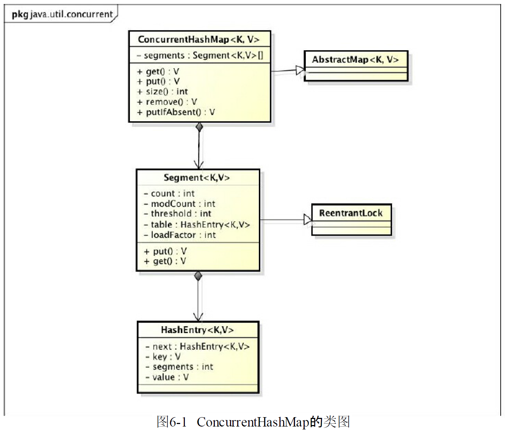

# ch6 Java并發容器和框架

## ConcurrentHashMap的實現原理和使用

ConcurrentHashMap是綫程安全且高效的HashMap.

### 爲什麽要使用ConcurrentHashMap

在并發編程中使用HashMap可能造成程序死循環(1.8以前)

1. 綫程不安全的HashMap

   以前的HashMap在并發執行put操作時會引起死循環,因爲多綫程下HashMap的Entry鏈表形成環形數據結構,一旦形成環形結構,Entry的next結點永遠不爲空,就會產生死循環獲取Entry

2. 低效率的HashTable

   HashTable容器使用synchronized來保證綫程安全,但在綫程競爭激烈的情況下HashTable的效率非常低.因爲儅一個綫程訪問HashTable的同步方法,其他綫程也訪問HashTable的同步方法時,會進入阻塞或輪詢狀態.

3. ConcurrenthashMap的鎖分段技術可以有效提高并發訪問速度

   HashTable容器在競爭激烈的并發環境下表現出效率低下的原因是所有訪問HashTable的綫程都必須競爭同一把鎖,假如容器裏有多把鎖,每一把鎖用於容器其中一部分數據,那麽儅多綫程訪問容器裏不同數據段的數據時,綫程閒就不會存在鎖競爭,從而可以有效地提高并發訪問效率,這就是ConcurrentHashMap所使用的鎖分段技術.首先將數據分成一段一段地存儲,然後給每一段數據配一把鎖,儅一個綫程占用鎖訪問其中一個數據段時,其他段的數據也能被其他綫程訪問.

### ConcurrentHashMap的結構

ConcurrentHashMap是由Segment數組結構和HashEntry數組結構組成.Segment是一種可重入鎖(ReentrantLock),在ConcurrentHashMap裏扮演鎖的角色;HashEntry則用於存儲鍵值對數據.一個ConcurrentHashMap裏包含一個Segment數組.Segment的結構和HashMap類似,是一種數組和鏈表結構.一個Segment裏包含一個HashEntry數組,每個HashEntry是一個鏈表結構的元素,每個Segment守護著一個HashEntry數組裏面的元素,儅對HashEntry數組的數據進行修改時,必須首先獲取與它對應的Segment鎖




### ConcurrentHashMap的初始化

ConcurrentHashMap初始化方法是通過`initialCapacity,loadFactory和concurrencyLevel`等幾個參數來初始化segment數組,段偏移量segmentShift,段掩碼segmentMask和每個segment裏的HashEntry數組來實現的

1. 初始化segments數組

   ```java
   
       /**
        * Creates a new, empty map with an initial table size based on
        * the given number of elements ({@code initialCapacity}), table
        * density ({@code loadFactor}), and number of concurrently
        * updating threads ({@code concurrencyLevel}).
        *
        * @param initialCapacity the initial capacity. The implementation
        * performs internal sizing to accommodate this many elements,
        * given the specified load factor.
        * @param loadFactor the load factor (table density) for
        * establishing the initial table size
        * @param concurrencyLevel the estimated number of concurrently
        * updating threads. The implementation may use this value as
        * a sizing hint.
        * @throws IllegalArgumentException if the initial capacity is
        * negative or the load factor or concurrencyLevel are
        * nonpositive
        */
       public ConcurrentHashMap(int initialCapacity,
                                float loadFactor, int concurrencyLevel) {
           if (!(loadFactor > 0.0f) || initialCapacity < 0 || concurrencyLevel <= 0)
               throw new IllegalArgumentException();
           if (initialCapacity < concurrencyLevel)   // Use at least as many bins
               initialCapacity = concurrencyLevel;   // as estimated threads
           long size = (long)(1.0 + (long)initialCapacity / loadFactor);
           int cap = (size >= (long)MAXIMUM_CAPACITY) ?
               MAXIMUM_CAPACITY : tableSizeFor((int)size);
           this.sizeCtl = cap;
       }
   ```

   由上可知,segment數組的長度ssize是通過concurrencyLevel計算得出的.爲了能通過按位與的散列算法來定位segments數組的索引,必須保證segments數組的長度是2的n次方,所以必須計算出一個大於或等於concurrencyLevel的最小的2的n次方值來作爲segments數組的長度

   > concurrencyLevel的最大值是65535,即segments數組的長度最大為65536 2>>15

2. 初始化segmentShift和segmentMask

   這兩個全局變量需要在定位segment時的散列算法裏使用,sshift等於ssize從1向左位移的次數,在默認情況下concurrencyLevel等於16,1需要向左位移4次,所以sshift等於4. segmentShift用於定位參與散列運算的位數,segmentShift等於32-sshift,等於28,這裏之所以用32是因爲ConcurrentHashMap裏的`hash()`方法輸出的最大數是32位,segmentMask是散列運算的掩碼,等於ssize-1,即爲15,掩碼的二進制各個位的值都是1,因爲ssize的最大長度是65536,所以segmentShift最大值是16,segmentMask最大值是65535,對應的二進制是16位,每個位都是1

3. 初始化每個segment

### ConcurrentHashMap的操作

1. get操作

   Segment的get操作實現非常簡單高效.先經過一次再散列,然後使用這個散列值通過散列運算定位到Segment再通過散列算法定位到元素

   ```java
   
   ```

2. put操作

3. size操作


### 入隊列

1. 入隊列的過程

入隊列就是將入隊節點添加到隊列的尾部.

* 添加元素1. 隊列更新head節點的next節點為元素1,又因爲tail節點默認情況下等於head節點,所以他們的next節點都指向元素1節點
* 添加元素2.隊列首先設置元素1節點的next節點為元素2節點,然後更新tail節點指向元素2節點
* 添加元素3.設置tail節點的next節點為元素3節點
* 添加元素4.設置元素3的next節點為元素4節點,然後將tail節點指向元素4節點


入隊主要做兩件事情:

* 將入隊列點設置成當前隊列為節尾節點的下一個節點
* 更新tail節點,如果tail節點的next節點不爲空,則將入隊節點設置成tail節點,如果tail節點的next節點爲空,則將入隊節點設置成tail節點的next節點,所以tail節點不總是尾節點.

在多綫程下,如果有一個綫程正在入隊,那麽他必須先獲取尾節點,然後設置尾節點的下一個節點為入隊節點,但這時可能有另一個綫程插隊了,那麽隊列的尾節點就會發成變化,這時當前綫程要暫停入隊操作,然後重新獲取尾節點.

```java
    /**
     * Inserts the specified element at the tail of this queue.
     * As the queue is unbounded, this method will never return {@code false}.
     *
     * @return {@code true} (as specified by {@link Queue#offer})
     * @throws NullPointerException if the specified element is null
     */
    public boolean offer(E e) {
        checkNotNull(e);
        // 創建入隊節點
        final Node<E> newNode = new Node<E>(e);

        for (Node<E> t = tail, p = t;;) {
            
            Node<E> q = p.next;
            if (q == null) {
                // p is last node
                if (p.casNext(null, newNode)) {
                    // Successful CAS is the linearization point
                    // for e to become an element of this queue,
                    // and for newNode to become "live".
                    if (p != t) // hop two nodes at a time
                        casTail(t, newNode);  // Failure is OK.
                    return true;
                }
                // Lost CAS race to another thread; re-read next
            }
            else if (p == q)
                // We have fallen off list.  If tail is unchanged, it
                // will also be off-list, in which case we need to
                // jump to head, from which all live nodes are always
                // reachable.  Else the new tail is a better bet.
                p = (t != (t = tail)) ? t : head;
            else
                // Check for tail updates after two hops.
                p = (p != t && t != (t = tail)) ? t : q;
        }
    }
```

整个入队过程主要做两件事:

* 定位出尾节点
* 使用CAS算法将入队节点设置成尾节点的next节点,如果不成功则重试

2. 定位尾节点

tail节点并不总是尾节点,所以每次入队都必须先通过tail节点找到尾节点.尾节点可能是tail节点,也可能时tail节点的next节点. 第一个判断就是判断tail是否有next节点,如果有 则表示next节点可能是尾节点. 获取tail节点的next节点需要注意的是p节点等于p的next节点的情况,只有一种可能就是p节点和p的next节点都等于空,表示这个队列刚初始化,正准备添加节点,所以需要返回head节点.

获取p节点的next节点

```java
    /**
     * Returns the successor of p, or the head node if p.next has been
     * linked to self, which will only be true if traversing with a
     * stale pointer that is now off the list.
     */
    final Node<E> succ(Node<E> p) {
        Node<E> next = p.next;
        return (p == next) ? head : next;
    }
```

3. 设置入队节点为尾节点

`p.casNext(null,n)`方法用于将入队节点设置为当前队列尾节点的next节点,如果p是null,表示p是当前队列的尾节点,如果不是null,表示有其他线程更新了尾节点,需要重新获取当前队列的尾节点.

4. HOPS的设计意图

让tail节点永远作为队列的尾节点,这样会导致每次都需要使用循环CAS来更新tail节点. 如果能够减少CAS更新tail节点的次数,就能提高入队的效率,所以doug lea 使用 hops变量来控制并减少tail节点的更新频率,并不是每次节点入队后都将tail节点更新成尾节点,而是当tail节点和尾节点的距离大于等于常量HOPS的值(默认等于1)时才更新tail节点,tail和尾节点的距离越长,使用CAS更新tail节点的次数就会越少,但是距离越长带来的负面效果就是每次入队时定位尾节点的时间就越长,因为循环体需要多循环一次来定位出尾节点,但这样仍然能够提高入队的效率,因为从本质上来看它通过增加对volatile变量的读操作来减少对volatile变量的写操作,而对volatile变量的写操作开销要远大于读操作,所以入队效率会有所提升.

> 入队方法永远返回true,所以不要通过返回值判断入队是否正确

### 出队列

出队列就是从队列里返回一个节点元素,并清空该节点对元素的引用

并不是每次出队都更新head节点,当head节点里有元素时,直接弹出head节点里的元素,而不会更新head节点.只有当head节点里没有元素时,出队操作才会更新head节点.这种方法也是通过hops变量来减少使用CAS更新head节点的消耗,从而提高出队效率

```java
 public E poll() {
        restartFromHead:
        for (;;) {
            for (Node<E> h = head, p = h, q;;) {
                E item = p.item;

                if (item != null && p.casItem(item, null)) {
                    // Successful CAS is the linearization point
                    // for item to be removed from this queue.
                    if (p != h) // hop two nodes at a time
                        updateHead(h, ((q = p.next) != null) ? q : p);
                    return item;
                }
                else if ((q = p.next) == null) {
                    updateHead(h, p);
                    return null;
                }
                else if (p == q)
                    continue restartFromHead;
                else
                    p = q;
            }
        }
    }
```

首先获取头节点元素,判断头节点元素是否为空,如果为空,表示另一个线程已经进行了一次出队操作将该节点元素取走,如果不为空,则使用CAS的方式将头节点的引用设置为null,如果CAS成功,则返回头节点元素,如果不成功,则表示另一个线程已经进行了一次出队操作更新了head节点,导致元素发生了变化,需要重新获取头节点.

## Java中的阻塞队列

### 什么是阻塞队列

阻塞队列(BlockingQueue)是一个支持两个附加操作的队列.这两个附加操作支持阻塞的插入和移除方法.

1. 支持阻塞的插入方法: 当前队列满时,队列会阻塞插入元素的线程,直到队列不满
2. 支持阻塞的移除方法: 在队列为空时,获取元素的线程会等待队列变为非空

阻塞队列常用于生产者消费者模式,生产者向队列里添加元素的线程,消费者从队列里取出元素的线程. 阻塞队列就是生产者用来存放元素,消费者用来获取元素的容器.


* 抛出异常: 当队列满时,如果在网队列里插入元素,会抛出`IllegalStateException("Queuefull")`异常.当队列空时,从队列获取元素会抛出`NoSuchElementException`异常
* 返回特殊值:当往队列插入元素时,会返回元素是否插入成功,成功返回true.如果移除方法,则是从队列里取出一个元素,如果没有则返回null
* 一直阻塞:当阻塞队列满时,如果生产者线程往队列里put元素,队列会一直阻塞生产者线程,直到队列可用或者响应中断退出.当队列空时,如果消费者县城从队列里take元素,队列会阻塞主消费者线程,直到队列不为空.
* 超时退出:当阻塞队列满时,如果生产者线程王队列里插入元素,队列会阻塞生产者线程一段时间,如果超过了指定时间,生产者线程就会退出.

> 如果是无界阻塞队列,队列不可能出现满的情况,有一使用put或offer方法永远不会阻塞,而且使用offer方法时永远返回true

### Java里的阻塞队列

* `ArrayBlockingQueue`: 一个由数组结构组成的有界阻塞队列
* `LinkedBlockingQueue`:一个由链表结构组成的有界阻塞队列
* `PriorityBlockingQueue`:一个支持优先级排序的无界阻塞队列
* `DelayQueue`:一个使用优先级队列实现的无界阻塞队列
* `SynchronousQueue`一个不存储元素的阻塞队列
* `LinkedTransferQueue`一个由链表结构组成的无界阻塞队列
* `LinkedBlockingDeque`一个由链表结构组成的双向阻塞队列

## Fork/Join框架


