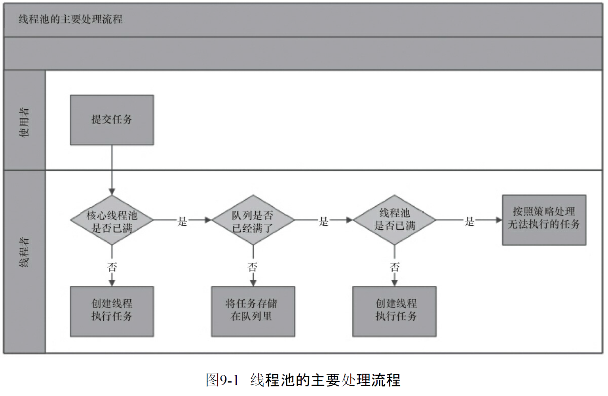
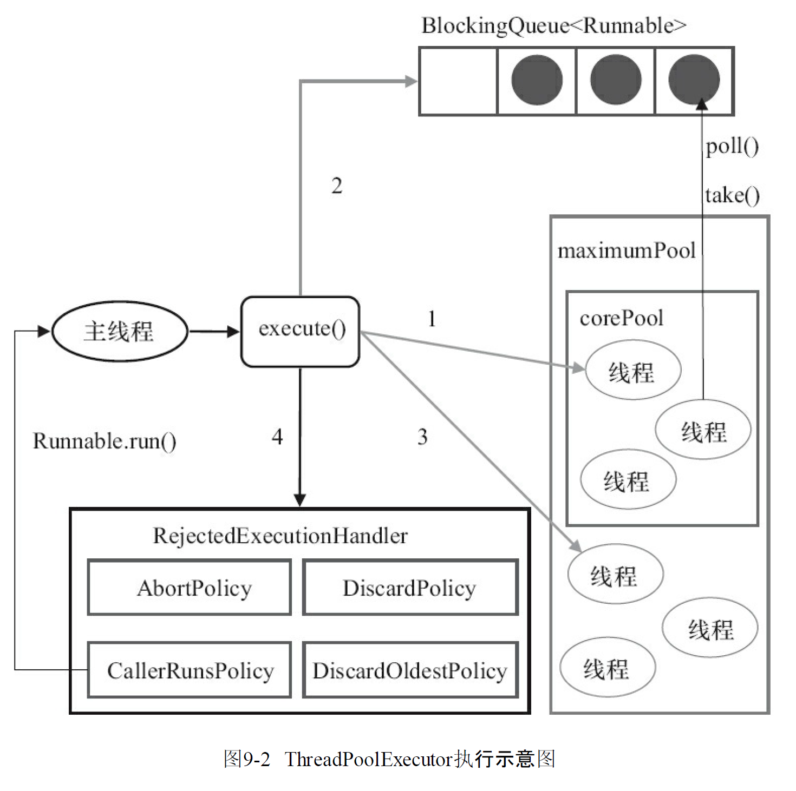
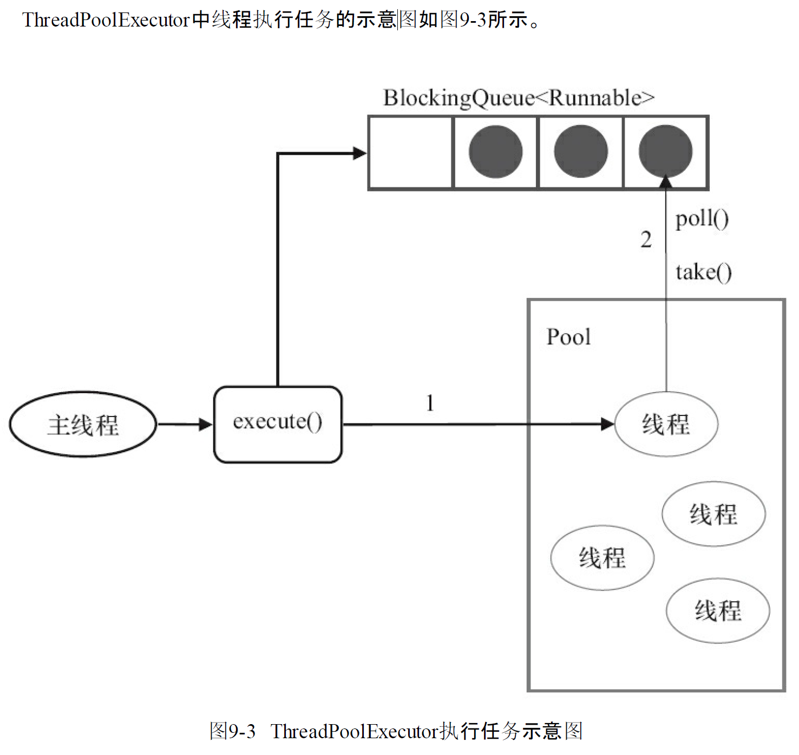

# Java中的线程池

合理地使用线程池能够带来3个好处

* 降低资源消耗.通过重复利用已经创建地线程降低创建线程和销毁造成的消耗
* 提高响应速度.当任务到达时,任务可以不需要等待线程创建就立即执行
* 提高线程的可管理性.线程是稀缺资源,如果无限制地创建,不仅会消耗系统资源,还会降低系统地稳定性,使用线程池可以进行统一分配,调优和监控.

## 线程池地实现原理

当向线程池提交一个任务后,线程池处理流程如下:

当一个新任务提交到线程池后

1. 线程池判断核心线程池里的线程是否都在执行任务.如果不是,则创建一个新的工作线程来执行任务.如果核心线程池里的线程都在执行任务,就进入下一个流程
2. 线程池判断工作队列是否已经满.如果没满,则将新提交的任务存储在这个工作队列里.如果满了进入下个流程
3. 线程池判断线程池的线程是否都处于工作状态.如果没有,则创建新的工作线程来执行任务.如果已经满了,则交给饱和策略来处理这个任务

`ThreadPoolExecutor` 执行`execute()`方法的示意图如下:

ThreadPoolExecutor执行execute方法分为下面四种情况

1. 如果当前运行的线程少于corePoolSize,则创建新线程来执行任务(注意,执行这一步需要获取全局锁)
2. 如果运行的线程数大于或等于corePoolSize,则将任务加入BlockingQueue
3. 如果无法将任务加入BlockingQueue(有界队列),则创建新的线程来处理任务(注意,执行这一步需要获取全局锁)
4. 如果创建线程将使当前运行的线程超出maximumPoolSize,任务将被拒绝,并调用RejectExecutionHandler.rejectedExecution()方法

ThreadPoolExecutor采取上述步骤的总体设计思路,是为了在执行execute()方法时,尽可能避免获取全局锁(那将会是一个严重的可伸缩瓶颈).在ThreadPoolExecutor完成预热之后(当前运行的线程数大于等于corePoolSize),几乎所有execute()方法调用都是执行步骤2,而步骤2不需要获取全局锁

```java
    /**
     * Executes the given task sometime in the future.  The task
     * may execute in a new thread or in an existing pooled thread.
     *
     * If the task cannot be submitted for execution, either because this
     * executor has been shutdown or because its capacity has been reached,
     * the task is handled by the current {@code RejectedExecutionHandler}.
     *
     * @param command the task to execute
     * @throws RejectedExecutionException at discretion of
     *         {@code RejectedExecutionHandler}, if the task
     *         cannot be accepted for execution
     * @throws NullPointerException if {@code command} is null
     */
    public void execute(Runnable command) {
        if (command == null)
            throw new NullPointerException();
        /*
         * Proceed in 3 steps:
         *
         * 1. If fewer than corePoolSize threads are running, try to
         * start a new thread with the given command as its first
         * task.  The call to addWorker atomically checks runState and
         * workerCount, and so prevents false alarms that would add
         * threads when it shouldn't, by returning false.
         *
         * 2. If a task can be successfully queued, then we still need
         * to double-check whether we should have added a thread
         * (because existing ones died since last checking) or that
         * the pool shut down since entry into this method. So we
         * recheck state and if necessary roll back the enqueuing if
         * stopped, or start a new thread if there are none.
         *
         * 3. If we cannot queue task, then we try to add a new
         * thread.  If it fails, we know we are shut down or saturated
         * and so reject the task.
         */
        int c = ctl.get();
        //如果线程数小于基本线程数,则创建线程并执行当前任务
        if (workerCountOf(c) < corePoolSize) {
            if (addWorker(command, true))
                return;
            c = ctl.get();
        }
        // 如果线程数大于等于基本线程数或创建线程失败,则将当前任务放到工作队列
        if (isRunning(c) && workQueue.offer(command)) {
            int recheck = ctl.get();
            if (! isRunning(recheck) && remove(command))
                reject(command);
            else if (workerCountOf(recheck) == 0)
                addWorker(null, false);
        }
        //如果线程池不处于运行中或任务无法放入队列,并且当当前线程数量小于最大允许的线程数量,则创建一个线程执行任务
        else if (!addWorker(command, false))
            //抛出RejectedExecutionException异常
            reject(command);
    }

```

```java
    /*
     * Methods for creating, running and cleaning up after workers
     */

    /**
     * Checks if a new worker can be added with respect to current
     * pool state and the given bound (either core or maximum). If so,
     * the worker count is adjusted accordingly, and, if possible, a
     * new worker is created and started, running firstTask as its
     * first task. This method returns false if the pool is stopped or
     * eligible to shut down. It also returns false if the thread
     * factory fails to create a thread when asked.  If the thread
     * creation fails, either due to the thread factory returning
     * null, or due to an exception (typically OutOfMemoryError in
     * Thread.start()), we roll back cleanly.
     *
     * @param firstTask the task the new thread should run first (or
     * null if none). Workers are created with an initial first task
     * (in method execute()) to bypass queuing when there are fewer
     * than corePoolSize threads (in which case we always start one),
     * or when the queue is full (in which case we must bypass queue).
     * Initially idle threads are usually created via
     * prestartCoreThread or to replace other dying workers.
     *
     * @param core if true use corePoolSize as bound, else
     * maximumPoolSize. (A boolean indicator is used here rather than a
     * value to ensure reads of fresh values after checking other pool
     * state).
     * @return true if successful
     */
    private boolean addWorker(Runnable firstTask, boolean core) {
        retry:
        for (;;) {
            int c = ctl.get();
            int rs = runStateOf(c);

            // Check if queue empty only if necessary.
            if (rs >= SHUTDOWN &&
                ! (rs == SHUTDOWN &&
                   firstTask == null &&
                   ! workQueue.isEmpty()))
                return false;

            for (;;) {
                int wc = workerCountOf(c);
                if (wc >= CAPACITY ||
                    wc >= (core ? corePoolSize : maximumPoolSize))
                    return false;
                if (compareAndIncrementWorkerCount(c))
                    break retry;
                c = ctl.get();  // Re-read ctl
                if (runStateOf(c) != rs)
                    continue retry;
                // else CAS failed due to workerCount change; retry inner loop
            }
        }

        boolean workerStarted = false;
        boolean workerAdded = false;
        Worker w = null;
        try {
            w = new Worker(firstTask);
            final Thread t = w.thread;
            if (t != null) {
                final ReentrantLock mainLock = this.mainLock;
                mainLock.lock();
                try {
                    // Recheck while holding lock.
                    // Back out on ThreadFactory failure or if
                    // shut down before lock acquired.
                    int rs = runStateOf(ctl.get());

                    if (rs < SHUTDOWN ||
                        (rs == SHUTDOWN && firstTask == null)) {
                        if (t.isAlive()) // precheck that t is startable
                            throw new IllegalThreadStateException();
                        workers.add(w);
                        int s = workers.size();
                        if (s > largestPoolSize)
                            largestPoolSize = s;
                        workerAdded = true;
                    }
                } finally {
                    mainLock.unlock();
                }
                if (workerAdded) {
                    t.start();
                    workerStarted = true;
                }
            }
        } finally {
            if (! workerStarted)
                addWorkerFailed(w);
        }
        return workerStarted;
    }
```

工作线程:线程池创建线程时,会将线程封装成工作线程Worker,Worker在执行完任务后,还会循环获取工作队列里的任务来执行

```java
    /**
     * Main worker run loop.  Repeatedly gets tasks from queue and
     * executes them, while coping with a number of issues:
     *
     * 1. We may start out with an initial task, in which case we
     * don't need to get the first one. Otherwise, as long as pool is
     * running, we get tasks from getTask. If it returns null then the
     * worker exits due to changed pool state or configuration
     * parameters.  Other exits result from exception throws in
     * external code, in which case completedAbruptly holds, which
     * usually leads processWorkerExit to replace this thread.
     *
     * 2. Before running any task, the lock is acquired to prevent
     * other pool interrupts while the task is executing, and then we
     * ensure that unless pool is stopping, this thread does not have
     * its interrupt set.
     *
     * 3. Each task run is preceded by a call to beforeExecute, which
     * might throw an exception, in which case we cause thread to die
     * (breaking loop with completedAbruptly true) without processing
     * the task.
     *
     * 4. Assuming beforeExecute completes normally, we run the task,
     * gathering any of its thrown exceptions to send to afterExecute.
     * We separately handle RuntimeException, Error (both of which the
     * specs guarantee that we trap) and arbitrary Throwables.
     * Because we cannot rethrow Throwables within Runnable.run, we
     * wrap them within Errors on the way out (to the thread's
     * UncaughtExceptionHandler).  Any thrown exception also
     * conservatively causes thread to die.
     *
     * 5. After task.run completes, we call afterExecute, which may
     * also throw an exception, which will also cause thread to
     * die. According to JLS Sec 14.20, this exception is the one that
     * will be in effect even if task.run throws.
     *
     * The net effect of the exception mechanics is that afterExecute
     * and the thread's UncaughtExceptionHandler have as accurate
     * information as we can provide about any problems encountered by
     * user code.
     *
     * @param w the worker
     */
    final void runWorker(Worker w) {
        Thread wt = Thread.currentThread();
        Runnable task = w.firstTask;
        w.firstTask = null;
        w.unlock(); // allow interrupts
        boolean completedAbruptly = true;
        try {
            while (task != null || (task = getTask()) != null) {
                w.lock();
                // If pool is stopping, ensure thread is interrupted;
                // if not, ensure thread is not interrupted.  This
                // requires a recheck in second case to deal with
                // shutdownNow race while clearing interrupt
                if ((runStateAtLeast(ctl.get(), STOP) ||
                     (Thread.interrupted() &&
                      runStateAtLeast(ctl.get(), STOP))) &&
                    !wt.isInterrupted())
                    wt.interrupt();
                try {
                    beforeExecute(wt, task);
                    Throwable thrown = null;
                    try {
                        task.run();
                    } catch (RuntimeException x) {
                        thrown = x; throw x;
                    } catch (Error x) {
                        thrown = x; throw x;
                    } catch (Throwable x) {
                        thrown = x; throw new Error(x);
                    } finally {
                        afterExecute(task, thrown);
                    }
                } finally {
                    task = null;
                    w.completedTasks++;
                    w.unlock();
                }
            }
            completedAbruptly = false;
        } finally {
            processWorkerExit(w, completedAbruptly);
        }
    }
```

ThreadPoolExecutor中线程执行任务示意图如下:

线程池中线程执行任务分为两种情况

1. 在execute()方法中创建一个线程时,会让这个线程执行当前任务.
2. 在这个线程执行完1流程后,会反复从BlockingQueue获取任务来执行

## 线程池的使用

### 线程池的创建

```java
  /**
     * Creates a new {@code ThreadPoolExecutor} with the given initial
     * parameters.
     *
     * @param corePoolSize the number of threads to keep in the pool, even
     *        if they are idle, unless {@code allowCoreThreadTimeOut} is set
     * @param maximumPoolSize the maximum number of threads to allow in the
     *        pool
     * @param keepAliveTime when the number of threads is greater than
     *        the core, this is the maximum time that excess idle threads
     *        will wait for new tasks before terminating.
     * @param unit the time unit for the {@code keepAliveTime} argument
     * @param workQueue the queue to use for holding tasks before they are
     *        executed.  This queue will hold only the {@code Runnable}
     *        tasks submitted by the {@code execute} method.
     * @param threadFactory the factory to use when the executor
     *        creates a new thread
     * @param handler the handler to use when execution is blocked
     *        because the thread bounds and queue capacities are reached
     * @throws IllegalArgumentException if one of the following holds:<br>
     *         {@code corePoolSize < 0}<br>
     *         {@code keepAliveTime < 0}<br>
     *         {@code maximumPoolSize <= 0}<br>
     *         {@code maximumPoolSize < corePoolSize}
     * @throws NullPointerException if {@code workQueue}
     *         or {@code threadFactory} or {@code handler} is null
     */
    public ThreadPoolExecutor(int corePoolSize,
                              int maximumPoolSize,
                              long keepAliveTime,
                              TimeUnit unit,
                              BlockingQueue<Runnable> workQueue,
                              ThreadFactory threadFactory,
                              RejectedExecutionHandler handler) {
        if (corePoolSize < 0 ||
            maximumPoolSize <= 0 ||
            maximumPoolSize < corePoolSize ||
            keepAliveTime < 0)
            throw new IllegalArgumentException();
        if (workQueue == null || threadFactory == null || handler == null)
            throw new NullPointerException();
        this.corePoolSize = corePoolSize;
        this.maximumPoolSize = maximumPoolSize;
        this.workQueue = workQueue;
        this.keepAliveTime = unit.toNanos(keepAliveTime);
        this.threadFactory = threadFactory;
        this.handler = handler;
    }
```

* corePoolSize(线程池的基本大小):当提交一个任务到线程池时,线程池会创建一个线程来执行任务,即使其他空闲的基本线程能够执行新任务也会创建线程,等到需要执行的任务数大于线程池基本大小时就不再创建,如果调用了线程池的`prestartAllCoreThreads()`方法,线程池会提前创建并启动好所有基本线程
* workQueue(任务队列):用于保存等待执行任务的阻塞队列,可选以下几种阻塞队列:
  * ArrayBlockingQueue:一个基于数组结构的有界阻塞队列,此队列按FIFO原则对元素进行排序
  * LinkedBlockingQueue:一个基于链表结构的阻塞队列,此队列按FIFO排序元素,吞吐量通常高于ArrayBlockingQueue.静态工厂方法Executors.newFixedThreadPool()使用了这个队列
  * SynchronousQueue:一个不存储元素的阻塞队列.每个插入操作必须等另一个线程调用移除操作,否则插入操作一直处于阻塞状态,吞吐量通常高于LinkedBlockingQueue,静态工厂方法Executors.newCacheThreadPool使用了这个队列
  * PriorityBlockingQueue:一个具有优先级的无限阻塞队列
* maximumPoolSize(线程池最大数量):线程池允许创建的最大线程数量.如果队列满了,并且已创建的线程数量小于最大线程,则线程池会再创建新的线程执行任务.值得注意的是,如果使用误解队列这个参数由没效果了.
* threadFactory:用于设置创建线程的工厂,可以通过线程工厂给每个创建出来的线程设置更具意义的名字
* rejectedExecutionHandler(饱和策略):当队列和线程池都满了,说明线程池处于饱和状态,那么必须采取一种策略处理提交的新任务.这个策略默认情况下是AbortPolicy,表示无法处理任务时抛出异常
  * AbortPolicy:直接抛出异常
  * CallerRunsPolicy:只用调用者所在线程来运行任务
  * DiscardOldestPolicy:丢弃队列中最近的一个任务,并执行当前任务.
  * DiscardPolicy:不处理,丢弃掉
* keepAliveTime(线程活动保持时间):线程池的工作线程空闲后,保持存活的时间.
* TimeUnit(线程活动保持时间的单位)

### 向线程池提交任务

可以使用两种方法向线程池提交任务,execute()和submit()

execute()方法用于提交不需要返回值的任务,所以无法判断任务知否被线程池执行成功